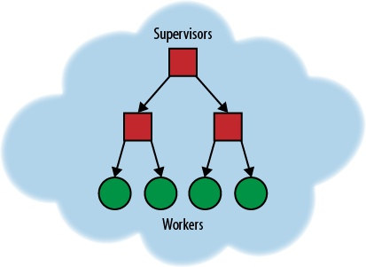
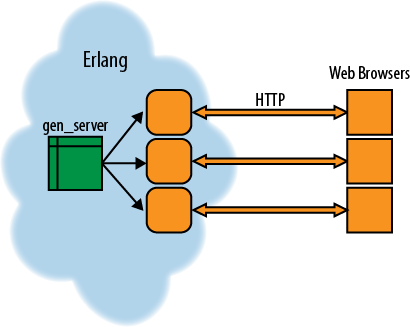
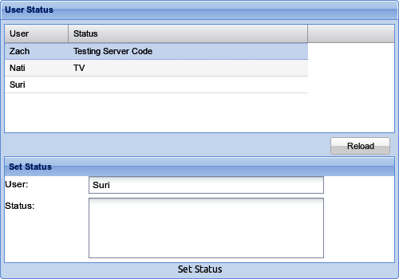

## 9. Building an Application with OTP

到目前为止，本书已经展示了一小部分Erlang或其他代码来展示一个或另一个想法。 本章做了一些不同的事情。 在这里，我将开发一个更大的应用程序来演示基于Erlang和Yaws的Web应用程序的所有部分如何挂在一起。

此应用程序将允许一群用户相互通知状态更新。 每当用户的状态在其浏览器或手机上发生变化时，服务器都会提供该更改。 它还会跟踪每个用户的状态，因此当用户登录时，她可以看到所有现有的状态消息。 这个应用程序可以作为许多分布式应用程序的基础，我希望它能说明如何在Erlang中构建应用程序。

> Note: 您可以随意使用此模块作为您自己产品的基础。 如果你真的很酷，请告诉我！

此应用程序还将应用程序拆分为多个层：我们将拥有一个将在用户之间进行协调的服务器级别，以及一个将使用简单Web界面的Web前端。

在本章中，我们将使用标准的Erlang/OTP结构构建更复杂的应用程序。通过这样做，我们可以利用OTP是一个非常好的测试框架，用于构建非常强大的服务器，并将其与Yaws中可与Web浏览器一起使用的界面相匹配。

OTP应用程序具有多个部分，所有部分都必须存在。首先，我们有实际执行应用程序任务的worker - 在这种情况下，跟踪用户状态消息。

但除了我们的workers，我们还有其他一些流程。第一种是supervisor。supervisor的存在是为了密切关注workers - 如果workers死亡，supervisor将重新启动该过程，并且用户在下次尝试轮询状态时将只看到重新启动的服务器。

要了解其工作原理，请参见图9-1。在此图中，每个框表示一个进程，每个进程负责树下它下面的进程。在这里，supervisor被描绘成正方形而workers是圆形。如果其中一个进程死亡（迟早会发生），其supervisor将重新启动它。完整设置不必在一台服务器上，因此右侧的节点可以在一台服务器上，而左侧的节点在另一台服务器上，从而使我们能够处理失败转移。如何完全做到这一点超出了本书的范围。



## 项目结构

OTP应用程序希望文件位于一组标准目录中。 这些是ebin，include，priv，src和test。 如果需要，可以向其添加其他目录。

ebin目录是唯一实际需要的目录，它应该包含.beam文件以及描述应用程序的.app文件（请参阅应用程序文件）。

src目录将保存应用程序所需的所有Erlang源。 任何.hrl包含文件都应该在include目录中。 测试代码当然位于测试目录中。

最终目录是priv，它可以包含应用程序可能需要的任何其他资源。 这可以包括模板，配置文件等等。 您始终可以通过调用code：priv_dir（Application）来获取应用程序的priv目录。

## 构建应用程序服务器

在Erlang中构建应用程序时，我想首先考虑在应用程序中移动的信息类型。 我通常会用铅笔和纸或白板来绘制图表。 但是，为了省去解读我的笔迹的麻烦，我将其翻译成更易读的形式（见图9-2）。



这个Web应用程序由几个部分组成，所以让我们从外面看一下。有一个部分在Web浏览器中运行（在服务器与Web的接口中介绍），它将通过Web资源与服务器通信。 浏览器是右侧的右侧方块，Yaws Web服务器是中间的圆形框，OTP服务器是图左侧的gen_server。

在这种情况下，我们使用多播服务器中显示的通用服务器来保存每个用户的状态。 用户将通过定期轮询Web界面上的更改来更新其状态。

## 通用服务器

OTP应用程序的实际逻辑将包含一组基本服务器，这些服务器通常围绕OTP库提供的基本抽象编写。主要的是gen_server，它是一个通用服务器。 gen_server提供服务器的所有标准部分，开发人员所要做的就是创建实现相关应用程序所需功能的函数。

与在Java中实现接口非常相似，为了实现gen_server，模块必须实现一些函数：start_link/0，init/1，handle_call/3，handle_cast/2，handle_info/2，terminate/2，code_change/3。如果您使用Emacs作为编辑器，Erlang模式将使用模板为您创建此结构以及许多其他模板。有关此模板的示例，请参阅附录D中的示例D-3。本章中的许多示例都基于Emacs模板。

要理解所有这些，有一个简单的模块可供查看。例9-1是一个简单的服务器，它将生成顺序唯一ID。
```
Example 9-1. Generate unique IDS (uniq.erl)

-module(uniq).
-behaviour(gen_server).

%% API
-export([start_link/0]).
-export([get_id/0]).
%% gen_server callbacks
-export([init/1, 
	 handle_call/3, 
	 handle_cast/2, 
	 handle_info/2,
	 terminate/2, 
	 code_change/3]).

-define(SERVER, ?MODULE). 

-record(state, {count}).

get_id() ->
    {id, ID} = gen_server:call(?MODULE, {}),
    ID.


%%%===================================================================
%%% API
%%%===================================================================

start_link() ->
    gen_server:start_link({local, ?SERVER}, ?MODULE, [], []).

init([]) ->
    {ok, #state{count= 1 }}.

handle_call(_Request, _From, State) ->
    Count = State#state.count,
    {reply, 
     {id, Count}, 
     #state{count = Count + 1}}.

handle_cast(_Msg, State) ->
    {noreply, State}.

handle_info(_Info, State) ->
    {noreply, State}.

terminate(_Reason, _State) ->
    ok.

code_change(_OldVsn, State, _Extra) ->
    {ok, State}.
```

该服务器通过调用start_link/0启动，它将通过调用init/1函数初始化服务器。 这总是从服务器的内部状态开始，计数为1。

该模块导出一个由函数get_id/0组成的函数API。 此函数使用gen_server:call/2函数从服务器发送请求ID的消息。 不像使用像Pid!get_id这样的东西，这有一个隐式超时。 如果服务器在五秒内没有响应，gen_server:call/2将会死亡并留言。 如果这个时间不够（或太多），您可以传递第三个参数，让您指定超时。 以毫秒或原子无穷大传递时间。

当有必要响应的消息进入时，将调用handle_call函数。 一般来说，这个函数会做一些事情并返回一个像{reply，Reply，NewState}这样的元组。

> Note:  如果您使用Haskell或类似语言编程，您可能会注意到gen_server看起来很像状态monad。

服务器中的函数使用的所有状态都绑定在传递给各种函数的State参数中; 没有其他工件，例如Java中的单例或JavaScript窗口对象。 这可能看起来非常严格，但实际上它可以实现一些非常强大的功能。

> Note: 这也使编写测试更容易！ handle_call函数通常接近纯函数，所有全局状态都在一个地方之前和之后。 没有机会出现奇怪的副作用，在那里找到一些东西。

OTP框架包装在一个结构中发送的消息，该结构使gen_server能够为不同类型的消息调用handle_cast和handle_call。但是，如果将消息发送到未由gen_server框架包装的服务器，则它将由handle_info/2处理。

如果您不需要此功能，那么使用handle_info/2函数将任何消息记录为错误将使您能够跟踪它们的发送位置。或者你可以完全省略handle_info/2函数;编译时会收到警告，但可以忽略它。在这种情况下，当向进程发送未知消息时，gen_server将终止该进程并留下错误消息。一般来说，这是你想要的，因为主管会重新创建它（参见让我们在这里有一些成人监督！）。请记住，在Erlang中，防御性编程很糟糕 - 我们希望服务器出错以便终止，以便主管可以启动具有已知良好状态的新副本。

如果您的服务器在完成后需要进行任何清理，请使用terminate/2函数。这可以关闭数据库连接或刷新缓冲区，删除临时文件等。terminate/2函数的第一个参数将是进程被终止的原因 - 可能是因为主管被告知要关闭，或正在关闭一些工作人员，或者链接节点正在关闭。

## 多播服务器

在我们的应用程序（例9-2）中，我们在multi_cast_server中有一个相当简单的服务器实现。 此服务器会跟踪每个用户的最新状态。 因此，此函数只有三个函数的外部API：get_current_user_status/0，它获取系统上所有用户的状态; get_current_user_status/1，获取特定用户的状态; 和 update_status/2，它更新用户的状态。

这些函数中的每一个都将通过gen_server:call/2函数向服务器发送一条消息，该消息将使用handle_call/3函数的一个子句进行回复。

handle_call/3函数接受三个可能的请求和服务器的当前状态，并更新状态或返回所请求的信息。

> NOTE：此服务器具有比您通常想要的更多的日志记录。 用于开发打很多日志语句。

组的实际状态作为状态值传递给每个元素。 在这种情况下，它只是一个数组，但在一个更复杂的例子中，它可能（并且可能应该是）更复杂数据结构的记录。 已创建两个函数来处理此状态：update_user_status/3和get_user_status/2。

```
Example 9-2. Multicast server


%%%-------------------------------------------------------------------
%%% @author Zach Kessin <>
%%% @copyright (C) 2012, Zach Kessin
%%% @doc
%%%
%%% @end
%%% Created : 21 Mar 2012 by Zach Kessin <>
%%%-------------------------------------------------------------------
-module(multi_cast_server).

-behaviour(gen_server).

%% API
-export([start_link/0]).

-export([get_current_user_status/0,
	 get_current_user_status/1,
	 update_status/2]).

%% gen_server callbacks
-export([init/1, handle_call/3, handle_cast/2, handle_info/2,
	 terminate/2, code_change/3]).

-define(SERVER, ?MODULE). 


%%%===================================================================
%%% API
%%%===================================================================

get_current_user_status() ->
    gen_server:call(?MODULE, {get_current_user_status}).
    

get_current_user_status(User) ->
    gen_server:call(?MODULE, {get_current_user_status, User}).
    

update_status(User, Status) ->
    ok = gen_server:call(?MODULE, {update_status, User, Status}),
    ok.

%%%===================================================================
%%% Functions for internal Use
%%%===================================================================

update_user_status([], User, Status) ->
    [{User, Status}];

update_user_status([{User, _OldStatus} | Tail], User, Status) ->
    [{User,Status} | Tail];

update_user_status([{O,S}|Tail], User, Status) ->
    R = update_user_status(Tail, User, Status),
    [{O,S}|R].

get_user_status(UserStatus, TargetUser) ->    
    case lists:filter(fun({User,_Status}) ->
			      User == TargetUser
		      end,
		      UserStatus) of
	[] ->
	    no_status;
	[TargetUserStatus] ->
	    {ok, TargetUserStatus}
    end.
    

%%--------------------------------------------------------------------
%% @doc
%% Starts the server
%%
%% @spec start_link() -> {ok, Pid} | ignore | {error, Error}
%% @end
%%--------------------------------------------------------------------
start_link() ->
    gen_server:start_link({local, ?SERVER}, ?MODULE, [], []).

%%%===================================================================
%%% gen_server callbacks
%%%===================================================================

%%--------------------------------------------------------------------
%% @private
%% @doc
%% Initializes the server
%%
%% @spec init(Args) -> {ok, State} |
%%                     {ok, State, Timeout} |
%%                     ignore |
%%                     {stop, Reason}
%% @end
%%--------------------------------------------------------------------


init([]) ->
    io:format("~n~p:~p(~p) init(~p)~n",
	      [?MODULE, ?LINE, self(), []]),

    {ok, []};

init(Status) ->
    io:format("~n~p:~p(~p) init(~p)~n",
	      [?MODULE, ?LINE, self(), Status]),
    {ok, Status}.

%%--------------------------------------------------------------------
%% @private
%% @doc
%% Handling call messages
%%
%% @spec handle_call(Request, From, State) ->
%%                                   {reply, Reply, State} |
%%                                   {reply, Reply, State, Timeout} |
%%                                   {noreply, State} |
%%                                   {noreply, State, Timeout} |
%%                                   {stop, Reason, Reply, State} |
%%                                   {stop, Reason, State}
%% @end
%%--------------------------------------------------------------------


handle_call({get_current_user_status}, _From, State) ->
    {reply, 
     {ok, State},
     State};

handle_call({get_current_user_status, User}, _From, State) ->
    {reply, 
     get_user_status(State, User),
     State};


handle_call({update_status, User, Status}, _From, State) ->
    io:format("~p:~p (~p) Update ~p -> ~p ~n",
	      [?MODULE, ?LINE, self(), User, Status]),
    io:format("STATE ~p ~n", [State]),
    NewState = update_user_status(State, User, Status),
    {reply, ok, NewState}.

%%--------------------------------------------------------------------
%% @private
%% @doc
%% Handling cast messages
%%
%% @spec handle_cast(Msg, State) -> {noreply, State} |
%%                                  {noreply, State, Timeout} |
%%                                  {stop, Reason, State}
%% @end
%%--------------------------------------------------------------------
handle_cast(_Msg, State) ->
    {noreply, State}.

%%--------------------------------------------------------------------
%% @private
%% @doc
%% Handling all non call/cast messages
%%
%% @spec handle_info(Info, State) -> {noreply, State} |
%%                                   {noreply, State, Timeout} |
%%                                   {stop, Reason, State}
%% @end
%%--------------------------------------------------------------------
handle_info(_Info, State) ->
    {noreply, State}.

%%--------------------------------------------------------------------
%% @private
%% @doc
%% This function is called by a gen_server when it is about to
%% terminate. It should be the opposite of Module:init/1 and do any
%% necessary cleaning up. When it returns, the gen_server terminates
%% with Reason. The return value is ignored.
%%
%% @spec terminate(Reason, State) -> void()
%% @end
%%--------------------------------------------------------------------
terminate(_Reason, _State) ->
    ok.

%%--------------------------------------------------------------------
%% @private
%% @doc
%% Convert process state when code is changed
%%
%% @spec code_change(OldVsn, State, Extra) -> {ok, NewState}
%% @end
%%--------------------------------------------------------------------
code_change(_OldVsn, State, _Extra) ->
    {ok, State}.

%%%===================================================================
%%% Internal functions
%%%===================================================================
```

在开发这个模块时，我首先使用-export()指令公开这两个函数，并通过尝试一些测试用例确保它们在测试数据上做了正确的事情。 一旦我确定这两个功能正常工作，我就删除了导出模块并启动了服务器。 然后，我尝试了Erlang命令行中的一些示例，如示例9-3中所述。 事实上，我将这个代码从Emacs缓冲区剪切并粘贴到Yaws中，后者在Emacs shell缓冲区中运行。 它让我的服务器错误崩溃，我修复了这个错误，并重复，直到一切正常。

```
Example 9-3. Multicast server test

c(multi_cast_server).
multi_cast_server:start_link().
multi_cast_server:update_status("Zach","Testing").
multi_cast_server:update_status("Nati","TV").
multi_cast_server:update_status("Zach","Coding").
multi_cast_server:get_current_user_status("Zach").
multi_cast_server:get_current_user_status().
```
> Note: 除了通用服务器（gen_server）之外，在OTP框架中还有一个通用的有限状态机（gen_fsm）实现和更多。 这些超出了本书的范围，但学习一些Erlang和Erlang文档很好地涵盖了它们。

## 将服务器与Web连接

到目前为止，我们有一堆Erlang服务有点有趣，但在它们自身中并不是特别有用，因为它们无法与外部世界接口 - 毕竟，这就是我们想要做的事情。 因此，我们需要编写一些代码来为所有这些提供Web界面。

为此，我们首先将htdocs目录添加到标准的Yaws目录集中。 此目录可以包含Web服务的所有面向公众的文件，包括.yaws文件，图像，CSS，JavaScript等。

> Note: 在这种情况下，我们将通过符号链接将htdocs目录连接到Yaws文档根目录，但我们也可以在yaws.conf文件中进行。 也可以在现有的Erlang设置中运行Yaws作为OTP应用程序，但这超出了本书的范围。

示例9-4中显示的第一个文件是一个简单的文件，它调用multi_cast_server:get_current_user_status/0函数，然后使用函数convert_to_json/1将结果格式化为服务器的JSON。 请注意，使用内置于Erlang中的list_to_binary/1函数将字符串转换为二进制文件。 如果你不这样做，那么你将在JSON中找回一个整数数组，这可能不是你想到的。

```
Example 9-4. Get status (status.yaws)

<erl>
convert_to_json(Data) ->
    Content = [{obj, [{name,   list_to_binary(Name)},
		     {status, list_to_binary(Status)}]} || 
		 {Name, Status} <-Data],
    {obj, [{data, Content}]}.
    
      
out(_Arg) ->
    {ok, Obj} = multi_cast_server:get_current_user_status(),
    io:format("~n (~p) Raw Data ~p~n", [self(), Obj]),
    JSON = rfc4627:encode(convert_to_json(Obj)),
    io:format("~n (~p) JSON ->  ~p~n", [self(), JSON]),
    {content, "application/json", JSON}.
</erl>

```

在这个例子中，我们再次提供了一些额外的日志信息; 日志的输出可以在例9-5中找到。 在这里，您可以看到从服务器返回的原始数据，以及转换为它的JSON（添加了额外的空格）。
```
Example 9-5. Get status log data

 (<0.365.0>) Raw Data [{"Zach","Coding"},{"Nati","TV"}]
 (<0.365.0>) JSON -> 
     "[{\"name\":\"Zach\",\"status\":\"Coding\"},{\"name\":\"Nati\",\"status\":\"TV\"}]"
```

用户可以通过向示例9-4发送GET来获取其他用户的状态。 这是一个非常简单的.yaws文件，仅用于调用服务器，然后将返回的数据转换为客户端期望的JSON。

要设置用户的状态，浏览器将向“set-status.yaws”发送POST请求（例9-6）。 如上所述，此文件仅包含足够的代码来解码用户的请求并将数据传递到服务器。

```
Example 9-6. Set status (set-status.yaws)

<erl>
out(Arg) ->
    {ok, Name}   = postvar(Arg, "name"),
    {ok, Status} = postvar(Arg, "status"),
    io:format("~n(~p) Name ~p, Status ~p ~n",
	      [self(), Name, Status]),
    multi_cast_server:update_status(Name, Status),
    {html, "true"}.


</erl>
```

## 客户端代码

对于客户端代码，我们将保持非常简单。 使用ExtJS，我们将构建一个简单的界面，显示网格中所有用户的当前状态。 在网格的底部将是用户可以输入其当前状态的字段。

在图9-3中，浏览器应用程序使用ExtJS编写的接口显示各种用户的当前状态。 例9-7中的CoffeeScript代码显示了一个网格的基本界面，显示每个用户及其状态。

界面还有一个允许用户设置其状态的表单。 此示例允许您为任何用户设置状态; 一个更健壮的例子当然应该使用一些身份验证来确定用户。

```
Example 9-7. Socket handler (socket_handler.coffee)

makeStore = ->
        store = Ext.create("Ext.data.Store",
                autoLoad : true
                fields   : ["name","status"]
                proxy    :
                        type   : "ajax"
                        url    : "status.yaws"
                        reader :
                                type: "json"
                                root: "data"
                )
        console.log(store)
        store

setupMultiCast = ->
        store = makeStore()
        form  = Ext.create("Ext.form.Panel",
                buttons:
                        {
                                xtype: "button"
                                text: "Set Status"
                                handler: () ->
                                        values = form.getValues()
                                        console.log(values)
                                        Ext.Ajax.request(
                                                url: "set-status.yaws",
                                                params: values
                                                success: () ->
                                                        store.load()
                                                        alert("Data Reloaded")
                                        )


                        }
                title: "Set Status"
                items: [
                        {
                                xtype      : "textfield"
                                name       : "name"
                                fieldLabel : "User"
                                width      : 400
                        }
                        {
                                xtype      : "textarea"
                                name       : "status"
                                fieldLabel : "Status"
                                width      : 400
                        }
                        ]
        )

        grid  = Ext.create("Ext.grid.Panel",
                width    : 500
                height   : 350,
                frame    : true
                renderTo : "multi_cast"
                store    : store
                title    : "User Status"
                bbar     : form
                buttons  : [
                        {
                                text: "Reload"
                                handler: () -> store.load()
                        }]

                columns:
                        [
                                {
                                        text: "User"
                                        width: 80
                                        sortable: true
                                        dataIndex: "name"
                                }
                                {
                                        text: "Status"
                                        dataIndex: "status"
                                        sortable: true
                                        width: 300
                                }
                        ]

                )

Ext.onReady setupMultiCast
```


## 让我们在这里有一些监督！

我们的服务器将长时间运行在不同用户之间分发消息。 迟早会出现问题。 如果发生这种情况，流程将终止，我们希望定义接下来会发生什么。 在这种情况下，需要做几件事：首先，应该重新启动服务器，我们还要记录发生的事情，以便我们以后修复它。

OTP使用主管的概念来完成所有这些事情，幸好建立一个基本的主管非常容易。 基本主管是主管行为。 像gen_server一样，你只需要创建一个导出一些函数的模块，就像gen_server一样，Emacs Erlang模式将创建一个你可以使用的模板。 示例9-8基于Emacs模板，其中删除了一些注释以供空间使用。
```
Example 9-8. Setting up our Supervisor

%%%-------------------------------------------------------------------
%%% @author Zach Kessin <>
%%% @copyright (C) 2012, Zach Kessin
%%% @doc
%%%
%%% @end
%%% Created : 18 Mar 2012 by Zach Kessin <>
%%%-------------------------------------------------------------------
-module(multi_cast_sup).

-behaviour(supervisor).

%% API
-export([start_link/0]).

%% Supervisor callbacks
-export([init/1]).

-define(SERVER, ?MODULE).

%%%===================================================================
%%% API functions
%%%===================================================================

%%--------------------------------------------------------------------
%% @doc
%% Starts the supervisor
%%--------------------------------------------------------------------
start_link() ->
    supervisor:start_link({local, ?SERVER}, ?MODULE, []).

%%%===================================================================
%%% Supervisor callbacks
%%%===================================================================

%%--------------------------------------------------------------------
%% @private
%% @doc
%% Whenever a supervisor is started using supervisor:start_link/[2,3],
%% this function is called by the new process to find out about
%% restart strategy, maximum restart frequency and child
%% specifications.
%%
%% @spec init(Args) -> {ok, {SupFlags, [ChildSpec]}} |
%%                     ignore |
%%                     {error, Reason}
%% @end
%%--------------------------------------------------------------------
init([]) ->
    RestartStrategy             = one_for_one,
    MaxRestarts                 = 1000,
    MaxSecondsBetweenRestarts   = 3600,

    SupFlags                    = {RestartStrategy, 
                                   MaxRestarts, 
                                   MaxSecondsBetweenRestarts},

    Restart                     = permanent,
    Shutdown                    = 2000,
    Type                        = worker,

    AChild                      = {'process_id', 
                                   {'AModule', start_link, []},
                                   Restart, 
                                   Shutdown, 
                                   Type, 
                                   ['AModule']},

    {ok, {SupFlags, [AChild]}}.

%%%===================================================================
%%% Internal functions
%%%===================================================================
```

创建管理程序时，需要创建一个导出init/1函数的模块。当supervisor启动时调用此函数，并定义创建和重新启动工作程序的方式和时间的规则。

supervisor作为自己的流程运行，除了监控其他流程（这些流程可以是其他supervisor或执行实际工作的流程）之外什么都不做。当这些其他进程死亡时，supervisor将重新启动它们;它还可以在关闭应用程序时杀死它们。

此外，supervisor是启动工作进程的地方。这是通过将supervisor init/1函数中的进程列为返回值的一部分来完成的。对于每个进程，我们得到一个类似于例9-9的结构。第一个字段是内部监督员使用的进程ID;它可能会显示在列表中，但您可能会忽略它。第二个术语讲述了如何启动我们的服务器。它应该包含模块，启动模块的功能（通常是start_link），以及传递给该函数的任何参数。
```
Example 9-9. Process init structure

{
  Process_id, 
  {Module, start_link, []},
  Restart, 
  Shutdown, 
  Type, 
  [Module]
}
```

重新启动术语告诉supervisor如果需要，如何以及何时重新启动此服务器。选项是永久的，临时的和瞬态的。永久进程将始终重新启动。永远不会重新启动临时进程。如果瞬态过程意外死亡，它将重新启动，但如果它正常终止，它将不会重新启动。

supervisor包括防止重新启动并立即退出的进程的保护。如果设置MaxR和MaxT值，它将在一段时间内将进程限制为设定的重新启动次数。在我们的示例中，我们将重启次数限制为每小时1000次;在生产系统中，这些数字需要根据应用的具体情况进行调整。

当关闭应用程序时，关闭术语开始起作用。当应用程序正在关闭工作程序时，进程可能需要关闭资源或以其他方式清理。因此，主管应该留出时间来做到这一点。在这种情况下，将Shutdown设置为以毫秒为单位的时间，表示每个进程在主管完全终止之前可以花多长时间。要杀死没有警告的进程，请将此设置为brutal_kill;如果进程可能需要很长时间，请将其设置为无穷大。正确设置此设置可能需要进行一些微调。

Type参数可以有两个可能的值：worker或supervisor。也就是说，该过程可以是工人或较低级别的监督。

最后我们有一个模块列表。通常这将是与上面使用的模块相同的模块，除非我们做一些奇怪和动态的事情，在这种情况下它可能是原子动态的。

现在我们已经建立了我们的主管，我们需要对其进行测试。要做到这一点，我们想让我们的服务器死于一个错误，并看到它重新启动。因此，我们将在update_user_status/3函数中引入一个新子句，当用户设置空白状态消息时，该子句将导致进程崩溃：

```
update_user_status(_users,_User, "") ->
    ok = status;
```
正如您在示例9-10中看到的，当我们将用户的状态设置为空字符串时，我们会收到错误并且该过程终止。

> WARNING: 从Erlang shell运行时，运行unlink（SupervisorPid）。 在测试重启之前。 否则崩溃进程也会使shell（重启）和supervisor崩溃。

```
Example 9-10. Running the supervisor

2> multi_cast_server:start_link().
{ok,<0.63.0>}
3> multi_cast_server:update_status("Zach","").
multi_cast_server:136 (<0.63.0>) Update "Zach" -> [] 
STATE [] 

=ERROR REPORT==== 3-Apr-2012::13:04:00 ===
** Generic server multi_cast_server terminating 
** Last message in was {update_status,"Zach",[]}
** When Server state == []
** Reason for termination == 
** {{badmatch,status},
    [{multi_cast_server,update_user_status,3},
     {multi_cast_server,handle_call,3},
     {gen_server,handle_msg,5},
     {proc_lib,init_p_do_apply,3}]}
** exception exit: {badmatch,status}
     in function  multi_cast_server:update_user_status/3
     in call from multi_cast_server:handle_call/3
     in call from gen_server:handle_msg/5
     in call from proc_lib:init_p_do_apply/3
```

理想情况下，您希望每个可能崩溃的工作单元都在其自己的进程中，以便尽可能小的工作单元崩溃。 在这种情况下，我们可以使用该函数创建更新状态并将其置于其自己的无状态进程中，该进程将简单地获取状态，更新它并返回它。

## 一点点优化

如果要增强此模块以提高速度，请创建第二个模块，该模块将缓存JSON并将数据hash创建为ETag。 然后让浏览器发送带有HTTP IF-None-Match标头的请求，如果数据没有更改，它将返回HTTP 304标头并使用它已有的数据。 好消息是服务器不必为每个请求计算哈希值或创建JSON，但只能在数据更改时才能执行。

> WARNING: 为了使Etags有效，他们需要保持一致。 如果用户每次发出请求时都会显示一个具有不同值的不同服务器，那么Etag将无用。 因此，为了使其工作，负载均衡器需要确保同一用户始终显示相同的服务器，或者确保用户可以确保用户从ETag看到一致的数据。

此服务器跟踪两条信息：输出JSON和浏览器将用于确定其是否具有最新数据的MD5 hash。

> Note: crypto:md5/1函数返回一个数字数组，它是数据的原始哈希值。 我们使用base64:encode_to_string/1函数将其转换为类似“4CNCRcsAqiYMz6mamgsjXg==”的字符串，这看起来像人们期望从MD5获得的东西。

我们在这里也获得了额外的可靠性。 我们可以对此进行设置，以便当此服务器崩溃时，它将重新启动并让init/1函数自动查询保存数据的服务器以刷新它。 另一方面，如果该服务器崩溃，我们可以设置它，以便该服务器也将重新启动，因此没有陈旧的数据。 这在例9-11中完成，它创建了一个服务器来创建JSON数据。

```
Example 9-11. Caching the results (multi_cast_front)

%%%-------------------------------------------------------------------
%%% @author Zach Kessin <>
%%% @copyright (C) 2012, Zach Kessin
%%% @doc
%%%
%%% @end
%%% Created :  5 Apr 2012 by Zach Kessin <>
%%%-------------------------------------------------------------------
-module(multi_cast_front).

-behaviour(gen_server).

%% API
-export([start_link/0]).

%% gen_server callbacks
-export([init/1, handle_call/3, handle_cast/2, handle_info/2,
	 terminate/2, code_change/3]).
-export([get_json/0, get_etag/0, update_status/2]).
-export([convert_to_json/1, make_state/0]).
-define(SERVER, ?MODULE). 


-record(state, {etag, json}).

get_json() ->
    gen_server:call(?MODULE, {get_json}).

get_etag() ->
    gen_server:call(?MODULE, {get_etag}).

update_status(User, Status) ->
    multi_cast_server:update_status(User, Status),
    gen_server:call(?MODULE, {update_status}).


%%%===================================================================
%%% API
%%%===================================================================

%%--------------------------------------------------------------------
%% @doc
%% Starts the server
%%
%% @spec start_link() -> {ok, Pid} | ignore | {error, Error}
%% @end
%%--------------------------------------------------------------------
start_link() ->
    gen_server:start_link({local, ?SERVER}, ?MODULE, [], []).

%%%===================================================================
%%% gen_server callbacks
%%%===================================================================


init([]) ->
    io:format("~n~p:~p(~p) init(~p)~n",
	      [?MODULE, ?LINE, self(), []]),

    State = make_state(),
    {ok, State}.

handle_call({get_json}, _From, State) ->
    {reply, State#state.json, State};

handle_call({get_etag}, _From, State) ->
    {reply, State#state.etag, State};

handle_call({update_status}, _From, _State) ->
    NewState = make_state(),
    {noreply, NewState}.


	
handle_cast(_Msg, State) ->
    {noreply, State}.

handle_info(_Info, State) ->
    {noreply, State}.

terminate(_Reason, _State) ->
    ok.

code_change(_OldVsn, State, _Extra) ->
    {ok, State}.

%%%===================================================================
%%% Internal functions
%%%===================================================================

convert_to_json(Data) ->
    Content = [{obj, [
		      {name,   list_to_binary(Name)},
		      {status, list_to_binary(Status)}]} || 
		 {Name, Status} <-Data],
    {obj, [{data, Content}]}.
   
 
make_state () ->  
    {ok, Data}	= multi_cast_server:get_current_user_status(),
    io:format("~n~p:~p(~p) new data  ~p~n",
	      [?MODULE, ?LINE, self(), Data]),

    Json	= rfc4627:encode(convert_to_json(Data)),
    Etag	= base64:encode_to_string(crypto:md5(Json)),
    io:format("~n~p:~p(~p) new data Etag: ~p ~p~n",
	      [?MODULE, ?LINE, self(), Etag, Json]),
    NewState	= #state{
      json = Json, 
      etag = Etag},
    NewState.
```

我们还需要更改示例9-8中的supervisor，以便启动两个服务器并以正确的方式重新启动它们。 除了第一个示例中的初始服务器之外，我还添加了名为“Front”的第二台服务器。

我还将重启策略从one_for_one更改为rest_for_one。 这确保了由于前端服务器在主服务器之后启动，因此如果主服务器是主服务器，它将重新启动，而不是相反。 这个新的supervisor如例9-12所示。

```
Example 9-12. Setting up our supervisor (Take 2)

-module(multi_cast_sup2).

-behaviour(supervisor).

%% API
-export([start_link/0]).

%% Supervisor callbacks
-export([init/1]).

-define(SERVER, ?MODULE).

%%%===================================================================
%%% API functions
%%%===================================================================


%%--------------------------------------------------------------------
%% @doc
%% Starts the supervisor
%%--------------------------------------------------------------------
start_link() ->
    supervisor:start_link({local, ?SERVER}, ?MODULE, []).

%%%===================================================================
%%% Supervisor callbacks
%%%===================================================================

init([]) ->
    io:format("~n~p:~p (~p) init([]) ~n",
	      [?MODULE, ?LINE, self()]),
    RestartStrategy             = rest_for_one,
    MaxRestarts                 = 1000,
    MaxSecondsBetweenRestarts   = 3600,
    ServerName			= multi_cast_server,
    ServerFrontName             = multi_cast_front, 
    SupFlags                    = {RestartStrategy, 
                                   MaxRestarts, 
                                   MaxSecondsBetweenRestarts},

    Restart                     = permanent,
    Shutdown                    = 2000,
    Type                        = worker,

    Server                      = {'multi_cast_server_id', 
                                   {ServerName, start_link, []},
                                   Restart, 
                                   Shutdown, 
                                   Type, 
                                   [ServerName]},
    Front                      ={'multi_cast_front_id', 
                                   {ServerFrontName, start_link, []},
                                   Restart, 
                                   Shutdown, 
                                   Type, 
                                   [ServerFrontName]},
    {ok, {SupFlags, [Server, Front]}}.

%%%===================================================================
%%% Internal functions
%%%===================================================================
```

我们还需要更改status.yaws和set-status.yaws文件（例9-4和9-6）以反映新接口。

set-status.yaws的情况非常简单，因为我们只需要将调用从multi_cast_server:update_status/2更改为multi_cast_front:update_status / 2（参见例9-13）。

```
Example 9-13. Setting the status with the front controller (set-status2.yaws)

<erl>
out(Arg) ->
    {ok, Name}   = postvar(Arg, "name"),
    {ok, Status} = postvar(Arg, "status"),
    io:format("~n(~p) Name ~p, Status ~p ~n",
	      [self(), Name, Status]),
    multi_cast_front:update_status(Name, Status),
    {html, "true"}.
</erl>
```

但是，我们在status2.yaws中还有一些额外的工作要做。 在这里，我们不再需要自己将数据转换为JSON，但我们必须检查缓存命中。 如果浏览器发送If-None-Match标头，我们将获得该标头的值并将其与存储在服务器上的ETag进行比较。 如果它们相同，我们应该发回304状态代码并告诉浏览器使用其缓存的数据副本; 否则我们发回实际数据，当然在标题中设置一个ETag。

```
Example 9-14. Getting status with ETags (status2.yaws)

<erl>

get_etag_header(Arg) ->
    Headers = Arg#arg.headers,
    Headers#headers.if_none_match.
   
get_response(Current_Etag, Header_Etag) 
  when Current_Etag =:= Header_Etag ->
    {status, 304};
get_response(Current_Etag, _Header_Etag) ->
    JSON = multi_cast_front:get_json(),
    io:format("~n (~p) JSON ->  ~p~n", [self(), JSON]),
    [
     {content, "application/json", JSON},
     {header, "Etag: "++ Current_Etag}
    ].

out(Arg) ->
    Header_Etag		= get_etag_header(Arg),
    Current_Etag	= multi_cast_front:get_etag(),
    io:format("~n (~p) If-None-Match: ~p ~n", [self(), Header_Etag]),
    io:format("~n (~p) ETag:  ~p ~n", [self(), Current_Etag]),
    get_response(Current_Etag, Header_Etag).
</erl>
```

运行示例9-14中的代码时，如果未设置If-None-Match标头或者它不匹配，则响应将类似于示例9-15。

```
Example 9-15. The output from Example 9-14

HTTP/1.1 200 OK
Server: Yaws/1.92 Yet Another Web Server
Date: Tue, 10 Apr 2012 15:44:58 GMT
Content-Length: 12
Content-Type: application/json
Etag: 4CNCRcsAqiYMz6mamgsjXg==

{"data":[]}
```

如果header匹配，则系统将返回例9-16，这将让客户端知道数据没有改变。

```
Example 9-16. Cache hit from Example 9-14

HTTP/1.1 304 Not Modified
Server: Yaws/1.92 Yet Another Web Server
Date: Tue, 10 Apr 2012 15:49:30 GMT
Content-Length: 1
Content-Type: text/html
```

## 捆绑为应用程序

当我们采取supervisor（让我们在这里进行一些成人监督！）和实际的工作人员时，我们可以将它们组合成一个“应用程序”，可以通过Erlang以标准方式启动和停止。 完成此操作后，可以通过调用application:start/1,2来启动应用程序服务器。 将它传递给要启动的应用程序的名称，如果需要，还要包含一个数组，该数组包含启动应用程序时应传递的任何参数。

应用程序行为可以与supervisor位于同一模块中，因为它们不共享任何功能名称，但最好将它们分开。 通常，应用程序应命名为 APPNAME_app.erl 和 supervisor APPNAME_sup.erl。

> Note: Erlang使用术语“应用程序”来指代一组相关的服务。 不要与该术语更常规的使用相混淆。

要创建应用程序，我们使用Emacs中的应用程序模板。 应用程序行为有两个函数，名为start/2和stop/1。 启动应用程序时将调用start函数，并在应用程序停止时调用stop函数。 通常这些将用于设置和清理。

```
Example 9-17. Setting up our application

%%%-------------------------------------------------------------------
%%% @author Zach Kessin <>
%%% @copyright (C) 2012, Zach Kessin
%%% @doc
%%%
%%% @end
%%% Created : 18 Mar 2012 by Zach Kessin <>
%%%-------------------------------------------------------------------
-module(multi_cast_app).

-behaviour(application).

%% Application callbacks
-export([start/2, stop/1]).

%%%===================================================================
%%% Application callbacks
%%%===================================================================

%%--------------------------------------------------------------------
%% @private
%% @doc
%% This function is called whenever an application is started using
%% application:start/[1,2], and should start the processes of the
%% application. If the application is structured according to the OTP
%% design principles as a supervision tree, this means starting the
%% top supervisor of the tree.
%%
%% @spec start(StartType, StartArgs) -> {ok, Pid} |
%%                                      {ok, Pid, State} |
%%                                      {error, Reason}
%%      StartType = normal | {takeover, Node} | {failover, Node}
%%      StartArgs = term()
%% @end
%%--------------------------------------------------------------------
start(_StartType, _StartArgs) ->
    io:format("~n~p:~p (~p) start(~p, ~p) ~n",
              [?MODULE, ?LINE, self(), _StartType, _StartArgs]),
    case multi_cast_sup2:start_link() of
        {ok, Pid} ->
            {ok, Pid};
        Error ->
            Error
                end.

%%--------------------------------------------------------------------
%% @private
%% @doc
%% This function is called whenever an application has stopped. It
%% is intended to be the opposite of Module:start/2 and should do
%% any necessary cleaning up. The return value is ignored.
%%
%% @spec stop(State) -> void()
%% @end
%%--------------------------------------------------------------------
stop(_State) ->
    ok.

%%%===================================================================
%%% Internal functions
%%%===================================================================
```

## App文件

Erlang中的每个应用程序都有一个位于ebin目录中的应用程序文件。该文件将包含一个类似于例9-18的大数据结构。该文件通常应标题为my_app_name.app-在我们的例子中为multi_cast.app。

此文件包含许多字段，实际上在创建一个字段时，您需要提取有关每个字段含义的文档，或者在旧示例上创建新文件。

元组以atom应用程序开头，后跟一个原子，即应用程序的名称。之后是一个包含几个关键字段的大型属性列表。描述字段是应用程序的描述。 vsn字段是应用程序的版本号。下一个字段模块将包含应用程序使用的模块列表。 OTP将确保模块仅属于一个应用程序，并且所有这些模块都存在。其中一些应用程序将是服务器进程，而其他应用程序可能只是一组功能。在此处列出这些模块将确保系统在您不在时会通知您。

注册字段包含应用程序注册的名称列表。这很有用，因为如果两个应用程序尝试注册相同的名称，OTP将知道并发出警告。

最后一项是mod，它是具有应用程序行为的回调模块。如果您的应用程序没有任何需要启动的服务（例如，如果它只是一堆纯函数），请忽略此行。

> WARNING: 示例9-18文件最后必须有一个句点（“.”），否则它将无效，并且会给出一个非常神秘的错误消息。

```
Example 9-18. Setting up our application (multi_cast.app)

{
  application,
  multi_cast,
  [
   {description, "Multi Cast Example"},
   {vsn, "1.0.0"},
   {modules, 
    [
     multi_cast_app, 
     multi_cast_sup2, 
     multi_cast_server,
     multi_cast_front
    ]},
   {registered, [multi_cast_server, multi_cast_front, multi_cast_sup2]},
   {mod, {multi_cast_app, []}}
  ]
}.
```

## 结束OTP

本章不是对OTP的完整介绍，也不是它的目的。但是，我想介绍一些OTP的基本结构，作为一种展示如何构建应用程序的方法。

我们在本章中构建的应用程序有一些固有的限制;一方面，用户的状态存储在列表中，这使得更新成为O（N）操作。由于我打算使用这个，列表中的项目数量很少，少于25个，这应该不是一个主要问题。如果需要，当然可以改变数据结构以使用不同的数据结构。

此外，此应用程序假定节点上只运行一个服务器副本。更现实的目标是拥有一个主管理员，为每组用户创建一个管理员和服务器。在这种情况下，我们将拥有大量用户组，每个用户组都有自己的服务器和supervisor。如果需要的话，那些将是一个主管理员将重新启动本地管理员，然后可以重新启动服务器。

简而言之，这里没有涉及很多东西。我没有介绍gen_fsm或gen_event，但是这些可以提供其他类型的服务器来很好地补充gen_server。