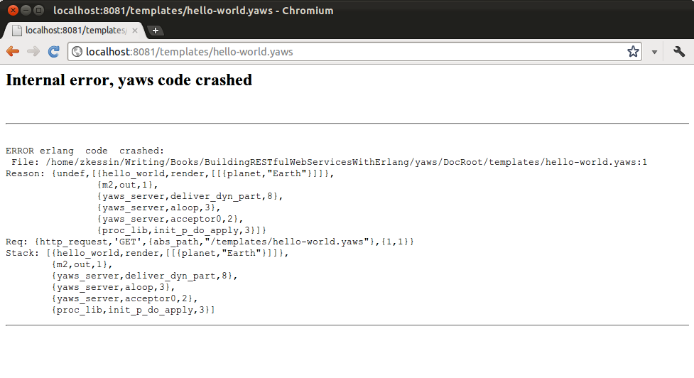

## 2. Yaws入门

大多数从其他Web开发环境迁移到Erlang和Yaws的开发人员都会使用其他Web服务器，如Nginx或Apache。 Erlang Yaws Web服务器执行相同的基本任务，但执行常见操作的详细信息通常不同。

Erlang不仅是一种语言，而且还是一个运行时系统，看起来很像应用程序服务器。因此，Erlang和Yaws（或其他Web服务器）将在一个系统中填充与Apache/PHP/MySQL和其他组件相同的角色。

Erlang/Yaws和Apache/PHP之间的主要区别与Erlang倾向于如何设置有很大关系。 Erlang系统将被集群化，Erlang中的进程与许多其他系统中的进程有些不同。

如果您已经将Apache与mod_php一起使用，您可能还记得每个请求都由进程或线程处理（取决于设置的方式）。经典的通用网关接口（CGI）将为每个请求启动一个新进程。这些线程和进程是操作系统的结构，是相对重量级的对象。在Erlang中，进程不是由操作系统拥有，而是由语言运行时拥有。

使用Apache和PHP构建应用程序时，对于每个请求，Web服务器必须提供PHP解释器的副本，并且很可能重新编译要运行的各种PHP代码。这是一项昂贵的操作。相比之下，在Yaws中，Erlang代码可能已经被编译和加载，因此在实践中，大多数时候所有Yaws需要做的就是调用正确的函数。

Erlang进程比OS线程轻得多。例如，启动它们，在它们之间发送消息或上下文切换它们所花费的时间比使用C或Java中的线程要小得多。这对应用程序的设计方式有一定的影响。虽然Java倾向于使用线程池，但在Erlang中，为每个客户端或套接字创建一个进程被认为是正常的，因为它们使用起来非常便宜。

由于Erlang进程非常轻量级且可以如此快速地启动，因此Yaws还可以为每个请求创建一个新进程，而不会出现任何问题。这意味着Yaws可以非常快速地扩展。

## 与Yaws一起工作

如果你从未使用Yaws工作，你有一些事情要习惯。 Yaws自然地设置了集群，它有自己的方式来创建动态内容和处理请求。 但总的来说，Yaws非常容易使用，并且它使用Erlang REPL，因此您可以在命令行尝试编码。

### 开始Yaws

一旦安装了Yaws（见[附录A](https://www.safaribooksonline.com/library/view/Building+Web+Applications+with+Erlang/9781449320621/apa.html)），就必须启动它。要在Unix命令行启动Yaws，只需运行yaws。在Windows中，从“开始”菜单启动Yaws的选项，但最常用的方法是从“开始”菜单打开DOS命令窗口并从那里执行。

您可以将许多命令行开关传递给Yaws。这些允许您设置节点名称或其他选项。这也可以通过.erlang文件来完成，Yaws首次启动时会读取该文件。此文件应包含有效的Erlang代码，并且应该位于用户的主目录中。

当Yaws启动时，它将打印出几行类似于[Example 2-1]()的信息，然后放入Erlang REPL。此时，Yaws功能齐全，可以为您发送的任何请求提供服务。从启动Yaws可执行文件到准备好向用户提供内容时，可能需要一两秒钟。

默认情况下，Yaws将设置为侦听端口8000（[Example 2-1]()由于使用该端口的其他内容而将其更改为8081）。通常我们希望在端口80上为HTTP运行Web服务器，或在端口443上为HTTPS运行Web服务器;但是，许多Unix类型的系统不允许非root用户绑定到编号低于1024的端口。显然，以root身份运行Erlang可能不是一个好主意，因此我们需要一个不同的解决方案。可以在捕获代理服务器后面运行Yaws，该服务器将端口80映射到更高端口。或者，您可以使用多种方法连接到更高端口。 Yaws网站http://yaws.hyber.org/privbind.yaws上记录了各种方法。你需要弄清楚哪一个最适合你的设置。

> Note: Yaws侦听的端口位于yaws.conf文件的<server>块中。 每个虚拟主机可以侦听不同的端口或IP地址，但它们都可以访问相同的模块。

```
Example 2-1. YAWS at startup

Eshell V5.8.3  (abort with ^G)
(yaws@sag)1> 
=INFO REPORT==== 1-Feb-2012::11:32:16 ===
Yaws: Using config file yaws.conf
(yaws@sag)1> 
=ERROR REPORT==== 1-Feb-2012::11:32:16 ===
'auth_log' global variable is deprecated and ignored. it is now a per-server variable
(yaws@sag)1> yaws:Add path "/usr/lib/yaws/custom/ebin"
(yaws@sag)1> yaws:Add path "/usr/local/lib/yaws/examples/ebin"
(yaws@sag)1> yaws:Running with id="default" (localinstall=false) 
Running with debug checks turned on (slower server) 
Logging to directory "/var/log/yaws"
(yaws@sag)1> 
=INFO REPORT==== 1-Feb-2012::11:32:17 ===
Ctlfile : /home/zkessin/.yaws/yaws/default/CTL
(yaws@sag)1> 
=INFO REPORT==== 1-Feb-2012::11:32:17 ===
Yaws: Listening to 0.0.0.0:8081 for <1> virtual servers:
 - http://www:8081 under /home/zkessin/Writing/ErlangBook/yaws/DocRoot
(yaws@sag)1>
```

除非您将它们重定向到文件，否则由Yaws中运行的程序发送的任何日志记录命令都将显示在Yaws启动代码中。 您还可以在此处编译模块和测试代码。 在需要长时间保持运行的系统中，在Unix程序屏幕内启动Yaws命令行可能很有用，这将允许会话暂停并在以后从另一台计算机恢复。 对于测试和开发，我经常在Emacs shell缓冲区中运行Yaws，从中我可以轻松地从暂存缓冲区复制和粘贴代码以进行测试。

当你启动Yaws时，它会读取一个yaws.conf文件。 此文件的默认位置将根据Yaws的设置方式而有所不同，但也可以通过命令行开关指定。 如果由于某种原因需要重新加载yaws.conf文件，可以通过调用yaws --hup来完成。

### 提供静态文件

虽然Web应用程序是围绕动态生成的内容构建的，但几乎所有Web应用程序都有一些需要提供给客户端的静态文件。这些通常是HTML，CSS，JavaScript，图像和其他媒体。 Yaws能够提供静态文件，并且在Apache中不需要特殊配置：只需将文件放在doc root下，Yaws就会很乐意将它们推送到浏览器。 （如果将Yaws嵌入到更大的Erlang应用程序中，情况可能并非如此。）

典型的Yaws安装将分布在多个节点上，因此集群中的每个节点都必须具有每个文件的最新副本。有几种方法可以做到这一点。如果群集大小很小（只有几个节点），那么简单地使用rsync来复制文件可能是一个很好的解决方案。在一个更大的系统中，使用系统的包管理器以及像Puppet（http://puppetlabs.com）这样的工具来分发文件可能是有意义的。也可以使用像CouchDB这样的系统来复制网络周围的资源。

**使用CGI接口**
```
虽然最好使用Yaws来管理用Erlang编写的代码，但您可能会发现通过老式CGI接口使用其他语言仍然有意义的情况。 值得庆幸的是，Yaws可以很好地完成这项工作 - 只需配置yaws.conf文件即可识别以.cgi或.php结尾的文件，以便正确处理。

为了从Yaws运行脚本，yaws.conf文件中的<server>块必须将allowed_scripts设置为包含“php”或“cgi”。 雅司网站上有完整的详细信息。

此外，out/1函数可以设置为通过调用yaws_cgi:call_cgi/2函数来调用CGI函数，在这种情况下，应该有条件地调用CGI函数或者需要特殊处理。
```

### 编译，加载和运行代码

当您从终端启动Yaws时，它将显示一个命令行REPL，可用于与Yaws和Erlang交互。 这是一个非常简单的方式来玩Yaws和尝试。

有几种方法可以编译和加载Erlang代码。 在测试中，最简单的方法是键入c（模块）。 在Yaws命令行。 这会将Erlang代码编译为.beam文件，这是Erlang的二进制格式，并将其加载到Erlang系统中。 使用lc([module1，module2])。 将对模块列表执行相同操作。 通常，.beam文件应放在代码搜索路径中的目录中。 在这种情况下，当需要未知模块时，它将自动加载。 要显式加载外部编译的.beam文件，请使用l（模块）。 将加载.beam文件。 （所有这些都接受一个原子，这是模块的名称。通过从Yaws命令行运行help/0函数，可以找到shell中的其他选项。）

> Note: Erlang程序在虚拟机中运行，与Java和.NET程序的运行方式相同。 在Erlang的案例中，虚拟机最初被称为“Bogdan的Erlang抽象机器”，现在是“Bjorn的Erlang抽象机器”（Bogdan和Bjorn是创建它们的程序员）。 因此，Erlang的二进制目标文件的扩展名为.beam。

您还可以使用cd/1和ls/0 shell命令更改目录并查看当前目录内容。

例2-2显示了Erlang shell中的简单交互。 打开shell，我们用pwd/0检查当前目录，然后用ls/0检查目录中的文件。

```
Example 2-2. ls and pwd

Erlang R14B02 (erts-5.8.3) [source] [64-bit] [smp:4:4] [rq:4] [async-threads:0] [kernel-poll:false]

Eshell V5.8.3  (abort with ^G)
1> pwd().
/home/zkessin/Writing/ErlangBook/running
ok
2> ls().
.svn            example.erl     test.erl        
ok
3> c(test).
{ok,test}
4> test:test(1234).
1234
5>
```

然后使用c/1函数编译示例2-3中所示的测试模块。 在这种情况下，模块编译正确，因此返回{ok，test}。 如果有错误，他们也会在这里报告。 最后我们运行test:test/1函数，它只返回它的参数。
```
Example 2-3. test.erl

-module(test).
-export([test/1]).
test(X) ->
    X.
```

c/1和l/1函数只会加载当前节点上的代码。如果要在所有连接的节点上加载代码，请使用nc/1和nl/1函数。这些工作就像单节点版本一样，但会将更改传播到所有连接的节点。

上面提到的编译和加载选项也将重新加载正在运行的模块。因此升级软件很容易;只需重新加载它并确保使用显式模块名称调用函数来进行升级（如果需要，可以使用显式消息）。

在某些情况下 - 比如你正在做一些涉及从Yaws命令行进行make-compiling的更大的事情可能不是最好的选择。在这种情况下，有一个显式的Erlang编译器erlc，[5]可以从Unix命令行或构建实用程序（如Make，Ant或Maven）调用。可以从Yaws命令行开关或yaws.conf文件显式加载模块。通常会设置一个Erlang项目，以便源存储在src目录中，并且在构建过程中将编译的文件移动到ebin目录。

Erlang支持代码自动加载。当调用my_module:my_function/n时，如果未加载模块my_module，则Erlang将尝试加载模块。

当Erlang尝试加载模块时，它将以与bash查找程序的方式非常相似的方式查看其文件路径。您可以通过从Erlang REPL运行code:get_path()来查看Erlang路径的内容。这将产生类似于实施例2-4的结果。要将新目录添加到路径的前面，请调用code:add_patha/1，并在结束调用code:add_pathz/1。如果调用成功，则两者都将返回true;如果不成功，则返回{error，bad_directory}。通常，这应该从您的主目录中的.erlang文件完成。

```
Example 2-4. Erlang path (Truncated)

(yaws@sag)16> code:get_path().
["/usr/local/lib/yaws/ebin",".",
 "/usr/lib/erlang/lib/kernel-2.14.3/ebin",
 "/usr/lib/erlang/lib/stdlib-1.17.3/ebin",
 "/usr/lib/erlang/lib/xmerl-1.2.8/ebin",
 "/usr/lib/erlang/lib/wx-0.98.9",
 "/usr/lib/erlang/lib/webtool-0.8.7/ebin",
 "/usr/lib/erlang/lib/typer-0.9/ebin",
 "/usr/lib/erlang/lib/tv-2.1.4.6/ebin",
 "/usr/lib/erlang/lib/tools-2.6.6.3/ebin",
```

### Yaws分布式

Erlang（以及Yaws）的主要优点之一是它被设计为存在于集群环境中。 Yaws服务本身可以通过简单地在多个节点上启动，然后将标准负载均衡器放在Web服务器前面来进行集群。 但是，在许多情况下，Yaws的真正威力来自于使用更大的Erlang应用程序运行Yaws的几个节点。 由于Yaws是本机Erlang代码，Yaws代码可以发送和接收Erlang消息，这使得Yaws应用程序能够存在于Erlang生态圈内。

为了让主机进行通信，它们必须共享应保持安全的cookie值。 此cookie可以在命令行中指定，使用Erlang内置函数（BIF）设置，或在.erlang.cookie文件中设置。 如果需要但是没有找到，Erlang将使用随机值创建该文件。 在设置Erlang网络时，找到分发此cookie文件的好方法可能是个好主意。

> 警告：在跨多个节点工作时，必须注意始终在所有节点上加载相同的代码。 Erlang具有这样做的功能，例如shell命令lc/1，但默认情况下不会在每个节点上加载新模块。 在升级系统时，软件必须能够处理某些节点可能正在运行较新版本或较旧版本软件的情况。

在Erlang中设置节点之间的链接实际上非常简单。 消息第一次从一个节点发送到另一个节点时，它们将连接在一起。 因此，调用net_admin:ping/1或发送任何其他消息将连接两个节点。

关于Erlang进程的一个好处是，在它们之间发送消息时，每个进程的运行位置都无关紧要。 代码 Pid ! message将消息发送到进程Pid。 Pid可以在同一台计算机上，在同一主机上的第二个Erlang进程中，在另一台计算机上，甚至在运行在世界各地的数据中心的计算机上。

在图2-1中，有两个节点 - A和B; 在这些节点中，有三个进程编号为1,2和3.消息可以通过它们在它们之间发送！ 运算符（此处用箭头表示），无论两个节点在哪里。

> 警告： 通常，在节点之间建立跨数据中心连接应使用SSL隧道，并且可能存在与节点之间的延迟有关的许多问题。


### Yaws动态内容

如果所需的结果是输出一个HTML或XML页面，有几种很好的方法可以解决这个问题。 如果您为Yaws提供扩展名为.yaws的文件，它将在该文件中查找标记为<erl>的任何块，并运行该块中的out/1函数。 这类似于PHP将如何调用<?php ?>标记内的代码以及有多少其他系统执行模板。 也可以使用像“ErlyDTL”这样的模板系统呈现HTML或XML（参见ErlyDTL）。

实际上，Yaws会将这些文件编译为.erl文件，该文件将存在于$HOME/.yaws目录中。 如果存在语法错误，则会给出确切的路径。

> Note: 在Erlang中习惯使用名称和奇偶校验来命名函数。 因此out/1是名为“out”的函数，它接受一个参数，在这种情况下是描述请求的数据结构。 函数out/2将是一个单独的函数，只需与out/1共享一个名称。

```
YAWS如何分配文件

当浏览器请求具有.yaws扩展名的文件时，Yaws将从磁盘读取该文件并解析该文件。任何纯HTML的部分都将发送到浏览器。

但是，<erl>块中的任何内容都将单独处理。偏航将采用每个<erl>块并将其转换为Erlang模块。然后，Yaws将编译代码并将其缓存在内存中，直到更改.yaws文件。因此，除非更改或首次访问文件，否则Yaws不必重新编译源代码。

然后，Yaws将函数out/1并将该函数的返回值插入到输出流中。如果存在没有out/1函数的<erl>块，Yaws会将其标记为错误。

如果Yaws在文件中找到两个或更多<erl>块，它只会将每个块转换为一个模块并单独编译和运行它们。

同样重要的是要注意，与PHP不同，Yaws在处理整个页面之前不会向套接字发送任何输出。因此，如果需要一些HTML输出，则可以在页面底部设置标题。

如果您想了解Yaws如何做到这一切的全部过程，请阅读http://yaws.hyber.org/internals.yaws上的Yaws Internals文档和yaws_compile.erl中的源代码。
```

使用yaws_api.hrl文件中定义的#arg{}记录的参数调用out/1函数（请参阅示例2-5）。 确定当前HTTP请求详细信息可能需要的所有数据都在此处，可用于确定要执行的操作。 这是来自雅司消息来源的#arg{}记录的定义。 在任何.yaws文件中，这将自动包含在内; 否则你必须将它包含在模块的标题中。

```
Example 2-5. Structure of the #arg{} record

-record(arg, {
          clisock,        %% the socket leading to the peer client
          client_ip_port, %% {ClientIp, ClientPort} tuple
          headers,        %% headers
          req,            %% request
          clidata,        %% The client data (as a binary in POST requests)
          server_path,    %% The normalized server path
                          %% (pre-querystring part of URI)
          querydata,      %% For URIs of the form ...?querydata
                          %%  equiv of cgi QUERY_STRING
          appmoddata,     %% (deprecated - use pathinfo instead) the remainder
                          %% of the path leading up to the query
          docroot,        %% Physical base location of data for this request
          docroot_mount,  %% virtual directory e.g /myapp/ that the docroot
                          %%  refers to.
          fullpath,       %% full deep path to yaws file
          cont,           %% Continuation for chunked multipart uploads
          state,          %% State for use by users of the out/1 callback
          pid,            %% pid of the yaws worker process
          opaque,         %% useful to pass static data
          appmod_prepath, %% (deprecated - use prepath instead) path in front
                          %%of: <appmod><appmoddata>
          prepath,        %% Path prior to 'dynamic' segment of URI.
                          %%  ie http://some.host/<prepath>/<script-point>/d/e
                          %% where <script-point> is an appmod mount point,
                          %% or .yaws,.php,.cgi,.fcgi etc script file.
          pathinfo        %% Set to '/d/e' when calling c.yaws for the request
                          %% http://some.host/a/b/c.yaws/d/e
                          %%  equiv of cgi PATH_INFO
         }).
```
在例2-6中，HTTP方法从#arg{}结构中提取，然后返回以呈现为HTML，如图2-2所示。

```
Example 2-6. Using ARG

<erl>
method(Arg) ->
  Rec = Arg#arg.req,
  Rec#http_request.method.

out(Arg) -> 
  {ehtml, f("Method: ~s" , [method(Arg)])}.
</erl>
```


也可以在一组模块中定义您的实际逻辑，这些模块通常被编译和加载到Erlang中，然后使用一组.yaws文件从Web调用这些函数。 为此，请使用如示例2-7中所示的.yaws文件。 这有一个out / 1函数，只需调用my_module:some_func/1，它可以完成实际工作。 这样，实际逻辑可以保存在普通的Erlang模块中，但没有appmods的复杂性（参见[第3章]()）。 只需记住从Erlang模块中导出所需的函数。

```
Example 2-7. Calling an external function

<erl>
out(Arg) ->
    my_module:some_func(Arg).
</erl>
```

在例2-8中，我们使用yaws_api:parse_post/1函数返回HTTP POST的参数列表。 还有一个函数yaws_api:parse_query/1，它将返回在HTTP GET操作中在查询字符串中发送的数据。

```
Example 2-8. Displaying POST variables

<erl>
out(Arg) ->
  {ehtml, f("~p", [yaws_api:parse_post(Arg)])}. 
</erl>
```
out/1可以返回多种选项。 如果它返回像{html，“Hello World”}这样的元组，则该字符串将逐字插入到HTML文档中。

### EHTML

从out/1返回类型的选项是{ehtml，DATA}，其中“ehtml”是一种域特定语言（DSL），允许您将Erlang数据结构映射到HTML元素。 EHTML数据结构的每个元素应该看起来像{Tag，Attributes，Content}，当然内容可以是进一步的EHTML记录，因此整个EHTML结构是递归的。

```
Example 2-9. EHTML example

{table, [],
 {tr, [{class, "row"}], 
  [{td, [], "Hello World"}]}}
```

例2-9中显示的EHTML将生成例2-10中所示的HTML。 如果Web服务需要，EHTML还可用于生成XML。

```
Example 2-10. EHTML example output

<table> 
<tr class="row"> 
<td>Hello World</td></tr></table>
```
在所有.yaws页面中，Yaws包含函数f/2，它是函数io_lib:format/2的别名。 这个函数类似于C函数sprintf()，除了它使用“〜”而不是“％”进行格式化，也就是说它需要一个格式化的字符串和一个参数列表并返回一个格式化的字符串。 有关所有选项的完整详细信息，请参阅http://www.langlang.org/doc/man/io_lib.html#format-2上的Erlang手册页。

### Header和重定向

有时Web应用程序希望设置一个或多个自定义标头以与请求的内容一起返回。 为此，返回元组{header，HeaderString}。 例如，{header，“X-Server:Yaws”}将发送回“X-Server:Yaws”作为标题。

要返回HTML以及多个标头，只需将元组放在返回值的列表中。 例2-11将使Yaws返回类似于例2-12的响应。

```
Example 2-11. Headers and content

<erl>
out(Arg) ->
	 [{html, "Header with HTML"},
	  {header, "X-Server: Yaws"}].
</erl>
```

```
Example 2-12. Headers and content response

HTTP/1.1 200 OK
Server: Yaws 1.90
Date: Fri, 30 Dec 2011 08:50:32 GMT
Content-Type: text/html
X-Server: Yaws

Header with HTML
```

有一些标题非常常见，以至于Yaws提供了一种发送它们的简写方法。 您可以使用以下格式设置 connection, location，cache_control，set_cookie，content_type或content_length：{content_length，4312}; 也就是说，作为一对简单的原子和价值。

此外，通过返回元组{status，Code}，Yaws允许您发回“200 OK”以外的状态。 因此，如果用户使用非法方法发送请求，则可以为创建的资源发回“201”或“405”。 为此，请返回{status，201}。

要将用户重定向到out/1函数的不同URI，请返回元组{redirect，URL}。 Yaws将发回HTTP 302 Found响应，这将导致浏览器重定向到新URI。 见例2-13。
```
Example 2-13. Redirect
<erl>
out(Arg) ->
    URL = "http://www.erlang.org",
    {redirect, URL}.
</erl>
```
HTTP标准要求请求的完整URL（请参阅示例2-13）。 但是，在许多情况下，重定向可能是从服务器上的一个资源到同一服务器上的另一个资源，因此使用相对URI可能有意义。 幸运的是，Yaws通过返回{redirect_local, RELATIVE_URI}提供了一种方法，如例2-14所示。 当然，在这两种情况下，选择是否重定向以及重定向的位置都不必在编译时修复。
```
Example 2-14. Local redirect

<erl>
out(Arg) ->
    RELATIVE_URI = "/some_other_file.yaws",
    {redirect_local, RELATIVE_URI}.
</erl>
```

> Note: 如果在开发中你遇到了重定向混乱，请尝试使用curl来解决问题。 它将允许您查看服务器发回的每个重定向，并找出出错的地方。 要进行curl重定向，请将--location选项传递给它。

### 模板

除了YHT中的动态内容中描述的EHTML和f/2函数之外，Erlang上还有几个模板包可用。 这些模板引擎允许开发人员将HTML与数据处理分开，这总是很好的做法。 这很好，因为它使您无需使返回的Erlang数据的结构与屏幕上显示给用户的确切结构相匹配。 它还提供了一组功能强大且众所周知的转换，可将Erlang函数的输出转换为用户可以看到的HTML。

### ErlyDTL

如果您熟悉Python Django模板库，则需要查看ErlyDTL包。 ErlyDTL是Erlang的Django模板库的一个端口，您可以在GitHub上的https://github.com/evanmiller/ErlyDTL找到它。可以在那里找到ErlyDTL的完整文档，Django模板库的完整文档可以在Django网站上找到：https://www.djangoproject.com/。

ErlyDTL compile/2函数接受一个模板 - 它可以是一个字符串，将被解释为文件或文字模板的路径，作为二进制文件和模块名称 - 并将其转换为具有一些已定义函数的已编译Erlang模块可用于呈现模板并获取有关它的一些信息。还有一个compile/3函数，允许开发人员指定编译选项。

要编译模板，如例2-15所示，首先加载ErlyDTL包（第2行）。在这种情况下，有必要首先使用代码更改Erlang的搜索路径：add_patha/1。之后，在第4行中，ErlyDTL：compile/2编译模板。
```
Example 2-15. Compiling ErlyDTL templates

(yaws@sag)1> code:add_patha("<root>/templates/erlydtl/ebin").
true
(yaws@sag)2> l(erlydtl).
{module,erlydtl}
(yaws@sag)3> cd("templates").
/home/zkessin/Writing/ErlangBook/yaws
ok
(yaws@sag)4> erlydtl:compile("<root>/templates/hello-world.dtl", hello_world).
ok

```

```
建立ERLYDTL作为make过程的一部分

在例2-15中，模板是在Erlang REPL上编译的，这非常适合测试并确保它们正常工作。 但是，一个真正的项目可能需要做一些像持续集成的事情，并且需要一个不同的解决方案来构建ErlyDTL模板。

在这种情况下，模板应位于其自己的目录中，并使用示例2-16中的脚本进行编译，作为构建过程的一部分。 该脚本将模板编译为.beam文件，可以像任何其他模块一样加载。

应该像例2-15中那样调用此脚本，可以从Make，Emake或您选择的构建系统调用该脚本。 只要.beam在Erlang的搜索路径中，它就会在需要时加载。

erlydtl_compile templates/hello_world.dtl hello_world ebin

EXAMPLE 2-16. ERLYDTL COMPILE SCRIPT

#!/usr/bin/env escript
-export([main/1]).

main([File_Name, Module, BinDir]) ->
    l(erlydtl),
    erlydtl:compile(File_Name, 
		    Module, 
		    [{out_dir,BinDir}]).

这个脚本使用escript，这是一种在Erlang中编写shell脚本的方法。 完整的细节超出了本书的范围，但精简版本是在运行时，使用命令行传递的参数列表调用main/1函数。
```

编译时，ErlyDTL模板将在Erlang中显示为导出一些函数的模块。 最基本的形式是template:render/1，它将返回{ok，Content}或{error，Error}。 还有一个模板：render/2版本，允许对模板功能进行一些自定义。 可以传递一个语言环境，一个适用于{％trans％}标签的翻译功能。 有关选项的完整列表，请参阅ErlyDTL网页。

ErlyDTL将采用Django模板并将其编译为Erlang .beam文件，其中包含可以像任何其他函数一样使用的模板的标准函数。

Django模板将符号放在双括号转义中，如例2-17所示。

```
Example 2-17. A simple DTL template

<h1>Hello {{ planet }}</h1>
```

编译模板后，可以使用模块：render/1函数调用它，如例2-18所示。

```
Example 2-18. Calling the template

<erl>
out(Arg) ->
    {ok,HTML} = hello_world:render([{planet, "Earth"}]),
    {html, HTML}.
</erl>
```

请注意，render/1函数返回{ok，HTML}，而out / 1应该返回类似{html，HTML}的内容，因此有必要展开render函数的结果并用不同的原子重新包装它们。 服务器将如例2-19中的输出返回到浏览器。
```
Example 2-19. Template output

<h1>Hello Earth </h1>
```

当调用Django模板时，要传入的数据将作为{Key，Value}形式的对列表发送，其中Key通常是Erlang原子。 因此在例2-18中，传递的值是[{planet，“Earth”}]。 如果有多个值，您可以将它们作为列表传递。 此外，该值不需要是简单的字符串，但可以是某种形式的数据结构，将由模板处理以生成列表或其他内容。

> 不是正确的工作权限
> 当Yaws请求出现问题时，它将显示如图2-3所示的屏幕。 在这种情况下，模板出现故障。
> hello_world:render/1 was not found because the module had not been loaded.
> 当ErlyDTL编译.dtl文件时，它默认会将代码加载到Erlang虚拟机中，但不会保存.beam文件，因此您必须在编译时指定选项out_dir，这将告诉ErlyDTL存储的位置 .beam文件。 如果未指定，则不会创建它们。

Django模板当然可以做的不仅仅是插入变量，如例2-17所示。 也可以在模板中包含显示逻辑。 例如，您可以使用{％for i in somelist％}来迭代列表，并使用{％cycle odd even％}之类的逻辑将替换行作为样式。

您还可以使用ErlyDTL构建XML和HTML文件，如例2-20所示。这里，模板遍历文章列表，并从#article记录中的每个字段中提取数据，以构建RSS提要的XML文档。
```
Example 2-20. RSS template

<?xml version="1.0"?>
<rss version="2.0">
  <channel>
    <title>Ferd.ca</title>
    <link>{{ url.base }}</link>
    <description>My own blog about programming and whatnot.</description>
    <language>en-us</language>
    <pubDate>{{ latest_date }}</pubDate>
    <lastBuildDate>{{ latest_date }}</lastBuildDate>
	<ttl>60</ttl>
	
    
    <item>
      <title>{{ article.title }}</title>
      <link>{{ url.base }}{{ article.slug }}.html</link>
      <description>{{ article.desc }}</description>
      <pubDate>{{ article.date }}</pubDate>
      <guid>{{ url.base }}{{ article.slug }}.html</guid>
    </item>
    
 
  </channel>
</rss>
```


关于Django模板库的完整教程超出了本书的范围，但可以在https://docs.djangoproject.com/en/dev/ref/templates/builtins/上找到它。 这记录了可以在DTL中使用的所有各种形式。

> Note: 除了ErlyDTL之外，还有其他Erlang模板引擎在Web上浮动。 每个都有自己的优点和缺点，因此您需要四处寻找特定问题的最佳解决方案。

## 日志

当然，任何Web服务器都需要能够记录数据，这些数据可用于分析错误以及商业智能等原因。

默认情况下，Yaws会创建许多日志文件。 这些文件存在的位置可以在yaws.conf文件中配置，但通常它们会在/var/log/yaws之类的地方。

第一个日志是访问日志，其格式与Apache和许多其他Web服务器保存其日志文件的格式相同。 参见例2-21。 （请注意，这通常都在一行上，但已经包含在几行中，以适应本书中的页面。）
```
Example 2-21. Access log

127.0.0.1 - - [24/Feb/2012:11:31:02 +0200] "GET /templates/hello-world.yaws HTTP/1.1" 500 774 
"-" "Mozilla/5.0 (X11; Linux x86_64) AppleWebKit/535.7 (KHTML, like Gecko) 
Ubuntu/11.10 Chromium/16.0.912.77 Chrome/16.0.912.77 Safari/535.7"
```
此外，在Yaws中报告的任何错误都将在文件/var/log/yaws/report.log中以类似于示例2-22的格式报告。
```
Example 2-22. Report log

=INFO REPORT==== 20-Sep-2011::13:49:39 ===
Yaws: Listening to 0.0.0.0:8080 for <1> virtual servers:
 - http://localhost:8080 under /usr/share/yaws

=ERROR REPORT==== 24-Sep-2011::19:15:26 ===
Yaws: bad conf: Expect directory at line 130 (docroot: /var/www/yaws) terminating
```
正如我们在前面的例子中看到的那样，如果你调用io:format/1，它会将字符串发送到Yaws控制台。 这对于测试等非常有用，但不会被捕获以供以后使用。 真正需要的是一个包，它将消息记录到磁盘或其他中心点上的文件中，以便以后收集和分析。

### Erlang OTP error_logger

Erlang提供标准的error_logger包作为OTP的一部分，允许程序员发送正常的信息，警告和错误级别。

>Note: Erlang进程将其控制台IO引导至其组长的控制台。 默认情况下，这将是启动该进程（或递归到控制台）的进程; 但是，有可能改变这一点。 有关更多信息，请参阅Erlang手册。

错误记录器是Erlang/OTP内核的标准部分，并且始终存在。 默认情况下，它会向tty发送错误; 但是，通过将error_logger参数设置为{file，FileName}，它将向指定文件发送错误。 也可以将error_logger的值设置为silent以完全关闭错误报告。

要发送错误消息，请调用error_logger:error_msg/1或error_logger:error_msg / 2。 第一个版本采用文本字符串，按原样发送到错误消息。 第二个版本采用字符串和将插入到该字符串中的参数列表。 其格式与io:format/2相同，类似于C的“sprintf”，但百分号由波浪号替换。

示例2-23显示了在Erlang程序中使用日志，显示了.yaws文件中的基本信息日志语句。
```
Example 2-23. Code with logging

<erl>
out(Arg) ->
    error_logger:info_msg("~p:~p User Entered the System~n",
			  [?MODULE,?LINE]),
    {html, "Logger"}.
</erl>
```

它将在控制台或文件中生成如示例2-24中的输出，具体取决于系统的设置方式。
```
Example 2-24. Log message

=INFO REPORT==== 16-Jan-2012::13:38:52 ===
m1:13 User Entered the System
```

macros？MODULE 和 ?LINE扩展到当前模块和该文件中的当前行。 因此，通过将它们放在日志语句中，可以查看日志消息的生成位置。 由于它来自此示例中的.yaws文件，因此模块将解析为类似m1的内容，并且该行不会是.yaws文件的实际行。

函数error_logger:warning_msg/1,2和error_logger:info_msg /1,2与error_msg/1,2函数完全相同，但是对于不同级别的错误。