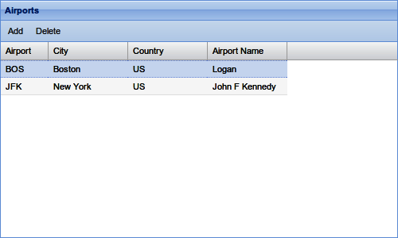

## 4. 实现REST

到目前为止，本书主要关注如何构建Web服务的部分，例如如何使用模板和响应请求。 现在是时候扩大我们的观点，以构建更大，更复杂的集成服务来处理复杂的业务需求。

在本章中，我将展示如何构建一个简单的RESTful服务来存储机场列表。 该服务将使用GET请求机场列表，POST用于添加新机场，PUT用于更新机场，DELETE用于删除一个机场。

本章将重点介绍如何将HTTP请求转换为某些Erlang代码并将其转换为正确的输出数据或服务器操作的技术方面。 例如，用户可以发送HTTP POST以创建新的机场记录，然后代码将该数据存储在Mnesia数据库中。

> Note: 本章中的大部分内容也适用于任何形式的Web服务，因为它们要求服务器检查传入的请求并做出适当的响应。

## 解构请求

当向服务器发出HTTP请求时，该请求附带了许多数据。 所有这些都通过Arg数据结构发送到out/1函数，并且可以从该数据结构中提取它们。 在某些情况下，有预先存在的函数来提取数据，在其他情况下，您将不得不创建函数来提取所需的内容。

### 提取用户Request

了解Web浏览器或其他客户端如何将数据发送到服务器非常重要。 在GET或HEAD请求的情况下，数据通过URL和查询字符串发送，因此请求看起来像get-stock-price?stock=ibm。 这里有两条信息：第一条是命令get-stock-price的路径，第二条是查询字符串stock=ibm。 对于那些熟悉PHP的人来说，这将由$_GET变量提供。 在POST或PUT请求中，除了查询字符串之外，还可以在请求正文中发送数据。

> Note: 我们也可以将此请求作为/get-stock-price/ibm，其优点是没有查询字符串（“？”之后的位），以及HTTP标准的大多数实现，包括代理服务器 和浏览器，不要缓存具有查询字符串的GET请求。 我们在URI不对应文件时看到了如何处理这种类型的请求。

对于通过GET或POST发送的值，可以使用简单的函数来提取数据。函数parse_query/1和parse_post/1获取Arg数据记录并返回[{Key，Value}]形式的元组列表。因此，如果请求URL以...?record=31415926结尾，则parse_query/1将返回{“record”，“31415926”}。

如果代码只关注特定值而不是获取整个参数列表，请使用yaws_api:postvar/2或yaws_api:queryvar/2函数。这些函数将在所有“.yaws”页面中自动导入，因此可以在没有 yaws_api: prefix的情况下使用。如果变量已设置，这些函数将返回{ok，Value}，如果不是，则返回undefined。

如果HTTP请求是HTTP POST，yaws_api:getvar/2函数将调用postvar/2，如果请求是HTTP GET，则调用queryvar/2。

在某些情况下（包括即将发布的示例4-15），数据不是作为HTML表单中的一组名称值对发送到服务器，而是作为HTTP POST请求的有效负载中的JSON或XML对象发送。在这种情况下，用户数据位于#arg记录的clidata字段中。要提取此使用代码，如例4-1所示。此函数使用Arg＃arg.clidata字段并将JSON解码为数据结构。然后它记录数据，最后使用rfc4627:get_field/3函数从数据结构中提取特定字段。 （这是从例4-14中提取的。）
```
Example 4-1. Getting a JSON from a HTTP POST

out(Arg) ->
     {ok, Json, _} = rfc4627:decode(Arg#arg.clidata),
     io:format("~n~p:~p POST request ~p~n", 
	       [?MODULE, ?LINE, Json]),
     Airport	= rfc4627:get_field(Json, "airport", <<>>),
     Airport.
```

如果用户已使用mime类型multipart/form-data上载文件，请使用函数yaws_api:parse_multipart_post / 1。 有关更多信息，请参阅[第5章](./File_Upload.md)。

## Response和Headers

REST的另一个重要部分是HTTP状态代码用于将信息返回给客户端。 因此，在创建新机场记录时，我们应该返回201 Created，而不是200 OK的状态，并且当请求不成功因为资源不存在时，服务应该返回404 Not Found。 有关HTTP状态代码的完整列表，请访问http://www.w3.org/Protocols/rfc2616/rfc2616-sec10.html。

默认情况下，Yaws将返回200 OK状态，因此如果需要其他一些状态代码，则out/1函数会返回带有所需HTTP代码的{status，Code}。 out/1函数可以返回元组列表，因此可以从返回代码中设置状态代码，标题和内容（以及任何其他选项）。 表4-1显示了所选状态代码的列表。

Table 4-1. Selected status codes

| Status Code |	Description| 
|------------------|--------------|
|100 Continue| 客户端想要发送大量请求时使用; 允许服务器仅基于标头接受或拒绝请求。 客户端必须发送Expect：100-continue.Continue当客户端想要发送大量请求时使用; 允许服务器仅基于标头接受或拒绝请求。 客户必须发送Expect：100-continue。|
|200 OK| 标准HTTP响应。 body应该包含内容。|
|201  Created| 已创建新资源。|
|202 Accepted | 已接受请求，但尚未采取行动。|
|203 Non Authoritative Information| 	服务器处理了请求但可能缺少完整的响应。|
|204 No Content| 服务器处理了请求但未返回任何内容。|
|205 Reset Content|像204一样，但客户端必须刷新其数据。|
|206 Partial Content| 服务器只发送部分数据。 这可以使用| 恢复中断下载。|
|300 Multiple Choices	| 服务器以多种格式呈现数据; 客户应该选择一个。|
|301 Moved Permanently|	重定向到新URI。|
|302 Found| 本来是“Moved Temporarily”; 不应该用于支持303和307。|
|303 See Other| 短期重定向到新URI |
|304 Not Modified	|表示客户端应使用资源的缓存副本。 |
|307 Temporary Redirect| 	资源临时位于不同的URI。|
|400 Bad Request| 由于语法错误，无法满足请求。|
|401 Unauthorized|	用户必须进行身份验证; 这将提示大多数浏览器要求输入用户名和密码。|
|403 Forbidden|	服务器拒绝回复请求。|
|404 Not Found| 资源不存在|
|405 Method Not Allowed|请求使用特定URI不支持的HTTP谓词。|
|406 Not Acceptable|服务器无法生成与“Accept”标头匹配的内容。 例如，图像可能仅作为.gif可用，而客户端希望它作为.png。|
|408 Request Timeout|	服务器超时等待客户端发送请求。|
|409 Conflict| 由于冲突，服务器无法更新资源，例如两个用户尝试更新同一记录。 |
|410 Gone	|资源已被删除，不会返回。 理想情况下应从搜索索引等中删除|
|411 Length Required |请求必须包含其内容的长度。|
|412 Precondition Failed|	请求不符合某些先决条件。|
|413| Request Entity Too Large|	当要上传的文件大于服务器要接受的文件时可以使用。|
|414| Request URI Too Long|	客户端发送的请求URI太长。|
|417 Expectation Failed	| 客户端发送了服务器无法接受的Expect请求标头。 |
|418| I’m a Little Teapot| 	Short and stout. |
|429| Too Many Requests |当一个用户在一段时间内发送过多请求时使用。|
|500| Internal Server Error |	通用错误消息。|
|501| Not Implemented |	服务器无法响应请求方法。|
|503| Service Unavailable	 |服务器暂时不可用|

如何构建测试前端有很多选项。 显然，我们可以在浏览器中使用jQuery和backbone.js或ExtJS构建JavaScript应用程序。 但是，为了测试，我们将使用Unix curl二进制文件，它允许我们从命令行或脚本发出命令。

为了证明这一点，我们将创建一个列出机场的简单数据 对于每个机场，我们将存储许多信息，包括机场名称，iata_code（例如，“JFK”），机场所在的城市和国家，以及跑道列表。 跑道存放在跑道记录中。 这些记录在例4-2中定义。

```
Example 4-2. Airport record

-record(airport,
        {code, city, country, name }).
```

在存在持久数据的任何应用程序中，必须选择如何存储它。 在本例中，我们将使用Erlang的内置Mnesia数据存储。 Mnesia与Erlang集成在一起，因此当Erlang存在时它将永远存在。 它也非常强大，可以执行跨多个服务器分区数据等操作。

Mnesia是一个相当灵活的数据存储，主要镜像SQL功能，但内置于Erlang中。 但是，Mnesia没有SQL中内置的约束，也没有SQL系统所具有的类型。 Mnesia也可以分布在几个节点上。 Mnesia表可以存在于磁盘上或仅存储在内存中，这样可以对性能进行大量控制。

要查找使用的HTTP方法，请查看Arg数据结构（请参阅示例4-3）。 在这种情况下，我们找到请求结构Rec，从那里我们查看方法字段。 事实上，这可以在一行中完成，但为了清楚起见，显示为两行。

```
Example 4-3. Deriving the method

method(Arg) ->
  Rec = Arg#arg.req,
  Rec#http_request.method.
```

## 构造Response

当请求进入rest模块时，它将被路由到out/1函数。 此函数使用method/1函数（示例4-3）查找HTTP方法，然后将事物路由到handle/2函数。 这个函数有四个版本，分别用于GET，POST，PUT和DELETE。 Erlang将匹配参数并调用正确的函数。

> Note: HTTP动词GET，POST，HEAD等被设置为Erlang原子而不是字符串。

QLC代表查询列表语法，是一组宏，它们重载Erlang中列表推导的含义，允许它们用作Mnesia数据库查询。一般结构是[ReturnedValue || Row <- mnesia:table(TableName), filters]，因此在例4-4的GET子句中，它列出了“airport”表中的所有记录。 这类似于SQL语句SELECT * FROM Airports。

例4-4中的代码（取自例4-14）显示了如何使用QLC查询Mnesia数据存储，然后将该数据转换为示例4-5中所示形式的JSON，可以将其发送到 浏览器。 （如何创建JSON将在JSON中介绍。）

```
Example 4-4. Generating the content

do(Q)->
    F = fun() ->
                qlc:e(Q) 
	end,
    {atomic, Value} = mnesia:transaction(F),
    Value.


convert_to_json(Lines) ->
    Data = [{obj, 
	     [{airport, Line#airport.code},
	      {city,    Line#airport.city},
	      {country, Line#airport.country},
	      {name,    Line#airport.name}]}
	    || Line <- Lines],
    JsonData = {obj, [{data, Data}]},
    rfc4627:encode(JsonData).

handle('GET', _Arg) ->
    io:format("~n ~p:~p GET Request ~n", [?MODULE, ?LINE]),
    Records = do(qlc:q([X || X <- mnesia:table(airport)])),
    Json = convert_to_json( Records),
    io:format("~n ~p:~p GET Request Response ~p ~n", [?MODULE, ?LINE, Json]),
    {html, Json};
```
```
Example 4-5. Generating the content (pretty printed)


{
    "data": [
        {
            "airport": "BOS",
            "city": "Boston",
            "country": "US",
            "name": "Logan"
        },
        {
            "airport": "JFK",
            "city": "New York",
            "country": "US",
            "name": "John F Kennedy"
        }
    ]
}

```

在GET请求的情况下，我们想要查询所有机场的Mnesia数据库。 （这是一个有限的例子;显然在实际的应用程序中，这可能会以某种方式进行过滤。）

handle/2方法的GET子句调用带有列表推导的 qlc:q 函数，该函数允许函数检索整个“Airports”表。 如果需要，也可以使用防护装置对其进行过滤。 这将返回放入“Rec”的记录列表。

在许多情况下，我们想要将数据返回给客户端的格式可以由客户端指定。 这可以通过使用HTTP Accept标头来完成。 例如，应用程序可以发送如下所示的Accept标头：
```
  Accept: application/xml, application/json
```
这个客户端想要XML或JSON格式的响应，但可能更喜欢XML。其他客户可以指定其他内容。在使用Web服务来提供JavaScript用户界面的情况下，可以忽略它并始终返回一种数据格式。然而，越来越多的Web服务被用于计算机到计算机应用程序，并且在这种情况下，能够支持多种数据格式可能是应用程序设计的关键特征。将内容返回到具有正确MIME类型的浏览器或其他客户端也是一个好主意。是否允许多种响应格式的选择将归结为应用程序所需的细节。但是，在大多数情况下，挑选一个并坚持使用它是可以接受的。

选择响应类型时，代码可以通过两种方式来决定。如果服务器宁愿发送一种格式，它可以查询Arg＃arg.headers数据结构中的标题，并询问是否允许给定格式。可以想象一个类似于例4-6的函数，其中传入MIME类型和Arg，如果MIME类型在列表中，则返回true或false。如果不存在Allowed标头，则程序应该做好定义的操作。它还应该能够处理包含*/*格式的请求，这表示所有格式都可以
```
Example 4-6. Format allowed

requested_formats(Arg) ->
    Rec    = Arg#arg.headers,
    Accept = Rec#headers.accept,
    [AcceptFormats| _]  = string:tokens(Accept, ";"),
    string:tokens(AcceptFormats, ",").


accept_format(Format, Headers) ->
    Res = lists:any(fun (F) ->
		      string:equal(Format, F) 
	      end, Headers).
```

### JSON

一种非常常见的数据交换方法是JSON，它是由Douglas Crockford在JavaScript的Object Literal Syntax中创建的，由RFC 4627定义.JSON很容易阅读，几乎所有语言都有JSON实现，所以它与其他人一起玩得很好。

一旦Mnesia向我们提供了机场列表，我们必须将该数据转换为JSON格式以传输到浏览器。为此，有许多Erlang模块可用于将Erlang数据转换为JSON表示。这些包括可以在GitHub上找到的rfc4627模块，包含在Yaws中的json2模块，以及其他一些模块。

使用rfc4627:decode/1函数解码JSON时，有两个选项。首先是它将返回{ok，Result，Remainder}。在这种情况下，Result是已解码的JSON，而Remainder是未解析的输入字符串的任何部分。如果由于某种原因rfc4627:decode/1无法解析JSON，它将返回{error，Reason}。最可能的原因是格式错误的JSON。

> Note: 如果您遇到JSON格式数据问题，请尝试将其传递给JSONLint（http://jsonlint.com）。 这将验证JSON字符串并对它们进行漂亮打印。

有时客户端会向我们发送JSON; 这里的一个问题是，JSON中表示的JavaScript对象的name-value对格式不能很好地映射到Erlang的数据结构上。 但是，仍然可以将JSON对象映射到Erlang的数据结构上。 给定示例4-7中的JSON，Erlang rfc4627模块将其映射到数据结构，如例4-8所示。
```
Example 4-7. JSON object

{
    "cust_id": 123,
    "name": "Joe Armstrong",
    "note": "wrote Erlang"
}

Example 4-8. Decoded JSON object

{obj,[{"cust_id",123},
      {"name",<<"Joe Armstrong">>},
      {"note",<<"wrote Erlang">>}]}
```

要记住JSON数据类型到Erlang类型的映射。 JSON中的数组映射到Erlang中的列表。 JSON中的数字映射到数字。 示例4-8中显示的字符串值映射到Erlang中的二进制值。 但是，Erlang中有许多JSON编码器和解码器，并非所有JSON编码器和解码器都将JSON映射到完全相同的数据结构上。

> WARNING: 如果您尝试将来自Erlang的PID值编码为JSON，它将无法工作，并且会给出相当混乱的错误消息。

该对象被映射到以atom obj开头的数据结构，以将其标记为JSON对象，然后将一组名称 - 值对映射为两个值元组的数组。

要从JSON对象获取特定字段的值，请使用rfc4627:get_field/2函数，该函数将decode/1输出的数据结构和字段名称作为原子并返回该字段的值。因此，在例4-8中调用rfc4627:get_field(Obj，name)将返回<<“Joe Armstrong”>>。另外，有一个函数rfc4627:get_field/3就像rfc4627:get_field/2一样，只是如果没有在JSON中设置值，则第三个参数是默认值。

当像例4-8那样构造一个obj结构时，函数rfc4627:set_field / 3会很有用。它将采用示例中显示的形式的对象，并返回一个相同类型的新对象，并将字段设置为值。因此，在示例记录上调用rfc4627:set_field（Obj，country，“Sweden”）会将国家/地区添加到数据结构中。

要创建要传递给客户端的JSON字符串，请使用rfc4627:encode/1函数，该函数将采用rfc4627:decode/1发出的相同格式的数据，并将其转换回JSON数据字符串。因此，例4-8中的数据结构将被编码为JSON，这与例4-7相同。此处的示例已由JSONLint重新格式化，以便于阅读;输出将全部在一行上。

试图使用类似于例4-9的代码将通用Erlang记录转换为JSON（或将转换为JSON的东西）是很诱人的。但是，必须使用文字原子来访问记录中的字段，因此Rec＃Type.Field将不起作用。它必须以Rec＃test_record.airport_name完成。 （但是，这里可以使用宏。）
```
Example 4-9. Convert to JSON (this won’t work!)


-module(convert_to_json).

-record(test_record, {room_name, room_users, desc}).
-export([convert_to_json/2]).

convert_to_json(Type, Rec) ->
    Fields = record_info(fields, Type),
    Struct = [{Field, Rec#Type.Field} || Field <- Fields],
    {obj, Struct}.
```

### XML

虽然我们的应用程序使用JSON进行数据传输，但在某些情况下，XML可能是更好的选择。 因此，有一种方法将数据从Erlang记录转换为XML将是一件有用的事情。

可以使用ehtml数据类型在Yaws中生成XML。 内容type1应设置为application / xml，顶行应设置为类似于此的标准XML声明：
```
<?xml version="1.0" encoding="utf-8"?>
```
或者，可以使用像ErlyDTL（参见ErlyDTL）这样的模板引擎来制作XML，如例2-20所示。

除了使用ehtml类型生成XML之外，还可以使用Erlang附带的xmerl包生成它，并使用xmerl_scan进行解析。

通常还需要扫描现有的XML文档。这可以使用Erlang附带的xmerl_scan包来完成。有两个基本功能，file/1和string/1。file/1函数将磁盘上的文件路径作为参数，而string/1将XML作为已在内存中的字符串。还有两个版本允许程序员在第二个参数中指定多个选项。查看xmerl_scan手册页以获取所有可能的选项。

运行xmerl_scan:file/1时创建的数据结构相当长。对于例4-10中显示的XML，它将生成如例4-11所示的数据。要从此数据结构中提取特定元素，可以通过xmerl_xpath模块使用XPATH。

```
Example 4-10. Sample XML

<?xml version="1.0" encoding="utf-8"?>
<user>
  <id>31415926</id>
  <name>Joe Armstrong</name>
  <note>Created Erlang</note>
</user>


Example 4-11. Parsed XML

{{xmlElement,user,user,[],
             {xmlNamespace,[],[]},
             [],1,[],
             [{xmlText,[{user,1}],1,[],"\n  ",text},
              {xmlElement,id,id,[],
                          {xmlNamespace,[],[]},
                          [{user,1}],
                          2,[],
                          [{xmlText,[{id,2},{user,1}],1,[],"31415926",text}],
                          [],".",undeclared},
              {xmlText,[{user,1}],3,[],"\n  ",text},
              {xmlElement,name,name,[],
                          {xmlNamespace,[],[]},
                          [{user,1}],
                          4,[],
                          [{xmlText,[{name,4},{user,...}],1,[],[...],...}],
                          [],undefined,undeclared},
              {xmlText,[{user,1}],5,[],"\n  ",text},
              {xmlElement,note,note,[],
                          {xmlNamespace,[],[]},
                          [{user,1}],
                          6,[],
                          [{xmlText,[{...}|...],1,...}],
                          [],undefined,undeclared},
              {xmlText,[{user,1}],7,[],"\n",text}],
             [],".",undeclared},
 []}
```

## 响应REST请求

当用户向Web服务器发送POST请求时，这是创建新机场记录的关键。 处理程序需要使用yaws_api:postvar/2从POST内容中查找机场名称和其他信息，然后应该使用airport创建一个airport:create_airport/5。 示例4-12获取机场名称和其他信息，创建机场记录，并将其插入Mnesia数据库。 关于Mnesia的好处是，如果设置正确，数据将自动在群集中复制。

通常，在响应HTTP请求时，我们返回200 OK的状态。 但是，这里我们正在创建一个新资源，因此返回201 Created状态是有意义的。 机构可以是空白的，或包含任何相关信息，例如机场的名称和ID。 在这种情况下，我们返回由浏览器发送的JSON，就像ExtJS框架所期望的那样。

```
Example 4-12. Generating the content

handle('POST', Arg) ->
    {ok, Json, _} = rfc4627:decode(Arg#arg.clidata),
    io:format("~n~p:~p POST request ~p~n", 
              [?MODULE, ?LINE, Json]),
    Airport	= rfc4627:get_field(Json, "airport", <<>>),
    City	= rfc4627:get_field(Json, "city", <<>>),
    Country	= rfc4627:get_field(Json, "country", <<>>),
    Name	= rfc4627:get_field(Json, "name", <<>>),
    _Status = addAirport(Airport, City, Country, Name),
    [{status, 201},
     {html, Arg#arg.clidata}];
```

## 一个完整的例子

到目前为止，本章已经使用了一些代码来说明如何执行服务的不同部分。本节将采用这些位并将它们统一为一个完整的服务，可以用作您自己的应用程序的基础。这里的大多数（但不是全部）代码来自前面的部分。

通常，REST服务需要执行以下两种操作之一：在Mnesia或其他数据存储中的工作记录，或通过来回发送消息与某种形式的后端应用程序交互。以下是使用Mnesia的完整示例。

在此示例中，当GET事件进入时，它将查询Mnesia，返回所有机场的列表，并将它们返回给用户。

当用户发送POST请求时，系统会将新记录添加到Mnesia数据存储中。如果需要，我们还可以在此处执行其他操作，例如使缓存无效或调用其他函数以执行其他操作。

当用户发送PUT请求时，我们将更新现有记录。在这种情况下，我们将通过其IATA代码查找并更新机场以获取新信息。我们无法处理机场更改其IATA代码的情况，但这应该是罕见的，我们可以删除记录并再次创建它。

当用户发送DELETE请求时，我们将从数据存储中删除该记录。

最后还有一个额外的子句来捕获任何不是四个主要HTTP请求之一的请求，并返回“405 Method Not Allowed”响应。

为了使所有这些工作，我们需要有机场数据格式;在这种情况下，它非常简单，如例4-2所示。此记录仅包括机场IATA代码，姓名，城市和国家/地区。

我们还必须在Mnesia数据存储中设置一个表，如例4-13所示。这必须在代码运行之前完成，通常在Yaws将在启动时运行的.erlang文件中完成。

> WARNING:对io的调用：format通过IO服务器序列化所有服务器活动; 删除它们进行生产。

```
Example 4-13. Setting up Mnesia

%% Add this to the .erlang file
application:start(mnesia).
mnesia:create_table(airport, 
		    [
		     {attributes,record_info(fields, airport)},
		     {index, [country]}]).
```

例4-14将所有机场示例代码放在一起。
```
Example 4-14. Full airport example

-module(rest).
-include("/usr/lib/erlang/lib/stdlib-1.17.3/include/qlc.hrl").
-include("/usr/lib/yaws/include/yaws_api.hrl").
-export([out/1, addAirport/4, handle/2]).
%-compile(export_all).


-define(RECORD_TYPE,      airport).
-define(RECORD_KEY_FIELD, code).

-record(?RECORD_TYPE,
        {?RECORD_KEY_FIELD, city, country, name }).

out(Arg) ->
    Method = method(Arg) ,
    io:format("~p:~p ~p Request ~n", [?MODULE, ?LINE, Method]),
    handle(Method, Arg).

method(Arg) ->
  Rec = Arg#arg.req,
  Rec#http_request.method.


convert_to_json(Lines) ->
    Data = [{obj, 
	     [{airport, Line#?RECORD_TYPE.code},
	      {city,    Line#?RECORD_TYPE.city},
	      {country, Line#?RECORD_TYPE.country},
	      {name,    Line#?RECORD_TYPE.name}]}
	    || Line <- Lines],
    JsonData = {obj, [{data, Data}]},
    rfc4627:encode(JsonData).

addAirport(Code, City, Country, Name) ->
    NewRec = #?RECORD_TYPE{ 
		 ?RECORD_KEY_FIELD	= Code,
		 city			= City,
		 country		= Country,
		 name			= Name},
    io:format("~p:~p Adding Airport ~p~n",
	      [?MODULE,?LINE, NewRec]),
    Add = fun() ->
                         mnesia:write(NewRec)
                 end,
    {atomic, _Rec} = mnesia:transaction(Add),
    NewRec.


handle('GET', _Arg) ->
    io:format("~n ~p:~p GET Request ~n", [?MODULE, ?LINE]),
    Records = do(qlc:q([X || X <- mnesia:table(?RECORD_TYPE)])),
    Json = convert_to_json( Records),
    io:format("~n ~p:~p GET Request Response ~p ~n", [?MODULE, ?LINE, Json]),
    {html, Json};

handle('POST', Arg) ->
    {ok, Json, _} = rfc4627:decode(Arg#arg.clidata),
    io:format("~n~p:~p POST request ~p~n", 
              [?MODULE, ?LINE, Json]),
    Airport	= rfc4627:get_field(Json, "airport", <<>>),
    City	= rfc4627:get_field(Json, "city", <<>>),
    Country	= rfc4627:get_field(Json, "country", <<>>),
    Name	= rfc4627:get_field(Json, "name", <<>>),
    _Status = addAirport(Airport, City, Country, Name),
    [{status, 201},
     {html, Arg#arg.clidata}];


handle('PUT', Arg) ->
    [IndexValue,_] = string:tokens(Arg#arg.pathinfo),    
    {ok, Json, _} = rfc4627:decode(Arg#arg.clidata),
    io:format("~p:~p PUT request ~p ~p~n",
              [?MODULE, ?LINE, IndexValue, Json]),
    Airport	= rfc4627:get_field(Json, "airport", <<>>),
    City	= rfc4627:get_field(Json, "city", <<>>),
    Country	= rfc4627:get_field(Json, "country", <<>>),
    Name	= rfc4627:get_field(Json, "name", <<>>),

    NewRec = #?RECORD_TYPE{
		 ?RECORD_KEY_FIELD	= Airport,
		 city			= City,
		 country		= Country,
		 name			= Name},

    io:format("~p:~p Renaming ~p", 
              [?MODULE, ?LINE, NewRec]),
    ChangeName = fun() ->
			 mnesia:delete(
			   {?RECORD_KEY_FIELD, IndexValue}),			     
                         mnesia:write(NewRec)
                 end,
    {atomic, _Rec} = mnesia:transaction(ChangeName),
    [{status, 200},
     {html, IndexValue}];


handle('DELETE', Arg) ->

    [IndexValue, _ ] = string:tokens(Arg#arg.pathinfo),    
    io:format("~p:~p DELETE request ~p",
              [?MODULE, ?LINE, IndexValue]),

    Delete = fun() ->
                     mnesia:delete(
                       {?RECORD_KEY_FIELD, IndexValue})
             end,

    Resp = mnesia:transaction(Delete),
    case Resp of
        {atomic, ok} ->
            [{status, 204}];
        {_, Error} ->
            io:format("~p:~p Error ~p ", 
                      [?MODULE, ?LINE, Error]),
            [{status, 400},
             {html, Error}]
    end;


handle(Method,_) ->
    [{error, "Unknown method " ++ Method},
     {status, 405},
     {header, "Allow: GET, HEAD, POST, PUT, DELETE"}
     ].


do(Q)->
    F = fun() ->
                qlc:e(Q) 
	end,
    {atomic, Value} = mnesia:transaction(F),
    Value.
```

最后，我们需要一个前端来使用所有这些。 我使用ExtJS在CoffeeScript中创建了一个简单的前端（参见http://sencha.com），它包含在例4-15中。 这将在浏览器中创建一个如图4-1所示的UI。

```
Example 4-15. CoffeeScript frontend (airport.coffee)

makeModel = ->
        Ext.define("Airport",
                extend: "Ext.data.Model",
                fields:[
                        {name: "airport"}
                        {name: "city"}
                        {name: "country"}
                        {name: "name"}
                        ]
        )

makeStore = ->
        model = makeModel()
        store = Ext.create("Ext.data.Store",
                autoLoad : true
                autoSync : true
                model    : model
                proxy    :
                        type   : "rest"
                        url    : "airports.yaws" # Will need to change the backend here
                        reader :
                                type: "json"
                                root: "data"
                        writer:
                                type: "json"
        )

setupAirports = ->
        store      = makeStore()
        rowEditing = Ext.create "Ext.grid.plugin.RowEditing"
        grid       = Ext.create "Ext.grid.Panel"
                renderTo : document.body
                plugins  : [rowEditing]
                width    : 500
                height   : 300
                title    : "Airports"
                store    : store
                columns:
                        [
                                {
                                        text      : 'Airport',
                                        width     : 60
                                        sortable  : true
                                        dataIndex : "airport"
                                        editor    : {allowBlank: false}
                                }
                                {
                                        text      : "City"
                                        dataIndex : "city"
                                        sortable  : true
                                        editor    : {allowBlank: false}
                                }
                                {
                                        text      : "Country"
                                        dataIndex : "country"
                                        sortable  : true
                                        editor    : {allowBlank: false}
                                }
                                {
                                        text      : "Airport Name"
                                        dataIndex : "name"
                                        sortable  : true
                                        editor    : {allowBlank: false}
                                }
                        ]
                dockedItems:
                        [
                                xtype: "toolbar"
                                items:
                                        [
                                                {
                                                        text: "Add"
                                                        handler: ->
                                                                store.insert(0, new Airport())
                                                                rowEditing.startEdit(0,0)
                                                }
                                                {
                                                        itemId: 'delete'
                                                        text: "Delete"
                                                        handler:  () ->
                                                                selection = grid
                                                                        .getView()
                                                                        .getSelectionModel()
                                                                        .getSelection()[0]
                                                                if(selection)
                                                                        store.remove(selection)
                                                }
                                        ]
                        ]

Ext.onReady setupAirports
```

