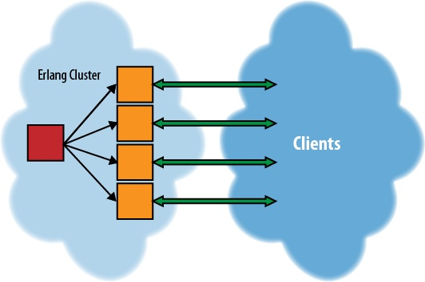

## 7. Streaming

有时您希望将数据从服务器流式传输到客户端，例如，用于Internet广播电台或Pandora或Ustream等服务。 Yaws 可以很好地做到这一点，并且程序员只需要很少的努力。

流数据和标准HTTP连接之间的区别在于流可以长时间保持打开状态（通常是数小时或数天），并在整个时间内将数据发送到客户端。 但是，与WebSockets（参见第6章）不同，流是单向数据连接，通常是二进制数据，如音乐或视频，而不是WebSocket中的文本数据。

## 简单的Streaming

要在Yaws中设置流，out/1函数应返回元组{streamcontent，MimeType，FirstChunk}，如例7-1所示。
```
Example 7-1. Setting up streaming (stream.yaws)

<erl>
 out(A) ->
    io:format("~nStarting audio stream~n"),
    spawn(streaming, stream_data, [self()]),
    {streamcontent, "audio/mp3", <<>>}.
</erl>
```
您还必须生成一个新进程以实际将数据发送到客户端。 这是在例7-1中调用spawn/3完成的。 这将创建一个新进程并传递创建进程的进程ID，如例7-2所示。 创建该进程时，out/1函数通过self/0函数将自己的PID传递给函数streaming:stream_data / 1。

要实际将数据发送到流，请使用Yaws创建PID和要发送的数据来调用函数yaws_api:stream_chunk_deliver / 2。 当流完成时，调用yaws_api:stream_chunk_end / 1告诉Yaws关闭事情。

> WARNING: 将音频或视频流式传输到HTML5 <audio>和<video>标签时，并非所有浏览器都支持所有格式。 因此，有必要转换格式，以便所有用户都能看到内容，如果您的前端是HTML5。

如果数据源比接收数据的速度快，则将yaws_api:stream_chunk_deliver / 2替换为yaws_api_stream_chunk_deliver_blocking / 2。 这将确保发送的数据不会溢出客户端的缓冲区。
```
Example 7-2. Sending data to a stream (streaming.erl)

-module(streaming).

-export([stream_data/1]).

stream_data(Pid) ->
    File    = "audio.mp3",
    FileHDL = open_file(File),
    stream_from_file(Pid, FileHDL, 1).

open_file(File) ->
    {ok, IoDevice} = file:open(File,
			       [read, binary]),
    IoDevice.
    
stream_from_file(Pid, File, I) ->
    Result = file:read(File, 4096),
    case Result of
	{ok, Data} ->
	    yaws_api:stream_chunk_deliver_blocking(Pid,Data),
	    stream_from_file(Pid, File, I+1);
	eof ->
	    yaws_api:stream_chunk_end(Pid);
	{error,Reason}->
	    error_logger:error_msg("~p:~p Error ~p ~n", 
				   [?MODULE, ?LINE, Reason])
    end.
```

当然，并非所有音频流都必须通过网络浏览器播放。 可以通过Windows Media Player，iTunes或VLC等媒体播放器播放音频。 图7-1显示了从Yaws流式传输的VLC中播放的音频流; 代码如例7-2所示。


虽然此示例从磁盘中提取数据以便简单地发送给用户，但也可以从另一个从外部源接收数据的进程发送数据。 在这种情况下，您希望将示例7-2中的函数stream_from_file / 3更改为将具有将获取数据的接收块的函数。

这样做的最大好处是，如果要向大量接收器发送数据，可以通过让一个接收循环处理一组用户来减少内存使用量。 当数据以某种方式（例如从音频输入）流入应用程序时，这将非常有意义。

为了帮助可视化此应用程序中的数据流，请参见图7-2。 在此图中，数据始终从左向右移动。 数据通过最左边的箭头进入系统，并流向Erlang云中的一行框，这是一个缓冲区，用于将数据发送到客户端的流媒体进程。

> Note: 在进程之间发送大型二进制消息时，Erlang不会复制二进制文件，只是传递引用。 但是，这对用户来说是不可取的。

