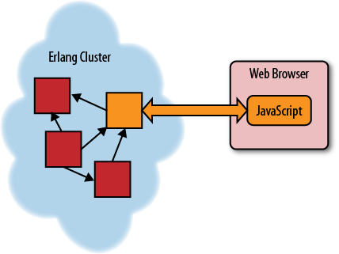
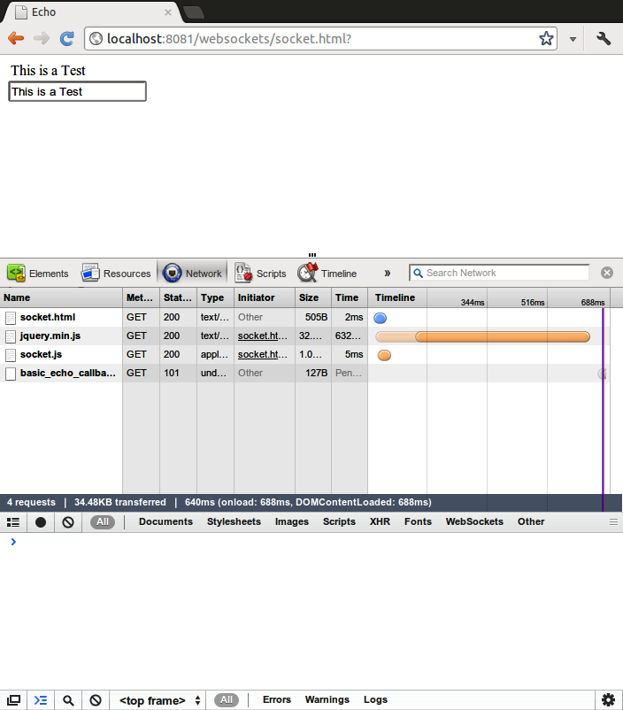

## 6. WebSockets

传统上，HTTP对于实时通信不是很好。 通信流由客户端控制，并且真正设计用于客户端想要不时加载或设置数据的情况。 已经使用了许多方法来模拟HTTP上类似TCP套接字的行为，但它们都不能很好地工作。 HTML5引入了WebSockets的概念，WebSockets是浏览器和服务器之间的全开双向通信通道。

在某些方面，WebSockets采用相反的方法来处理浏览器和客户端之间的交互，而不是REST。 REST是围绕浏览器（或其他客户端）将向表单的服务器发送大量离散请求，显示此数据或执行某些操作的想法构建的。

> Note: 由于不是所有的浏览器都支持WebSockets，因此采用跨平台的方式处理通信会很有帮助。 这可以使用JavaScript包Socket.io（http://socket.io）和Erlang包socket.io-erlang（https://github.com/yrashk/socket.io-erlang）来完成。

从Erlang的角度来看，WebSockets使浏览器和Erlang应用程序之间的交互更加透明。 Erlang应用程序通常由一堆小服务器组成，它们在它们之间传递消息。 当在用户的浏览器和Erlang应用程序之间打开WebSockets时，我们可以将该模型推送到用户的浏览器上。

要想象这一点，请参见图6-1。 左边的Erlang云由一组在它们之间传递消息的过程（显示为正方形）组成（如箭头所示）。 有一个过程以橙色显示，圆角打开WebSocket（双箭头），与Web浏览器和客户端应用程序通信。 通过扩展，可能有许多套接字连接到许多Web浏览器，允许用户之间的通信。



值得庆幸的是，虽然在JavaScript和Erlang中调用事件处理程序的语法有些不同，但语义非常相似。 在Erlang中，我们可以使用接收块或类似gen_server或gen_fsm的OTP行为。 在JavaScript中，我们可以使用.onmessage事件处理程序并在参数列表中的字典中查找数据。

但是，Web浏览器不了解Erlang消息格式，因此我们需要在Erlang发送的内部消息和浏览器可以理解的格式之间进行转换。 这可以使用JSON，XML，HTML或自定义格式完成。 在本章中，我将使用JSON，因为它是最容易在浏览器中使用的，但如果它们有意义，其他格式也可以使用。

## WebSocket请求

使用jQuery在JavaScript中设置WebSocket，请使用示例6-1中的代码。 通过使用服务器资源的URL创建WebSocket对象来打开套接字。 一旦套接字准备好行动，JavaScript将调用socket.onopen处理函数。

```
Example 6-1. socket.js

$(function ()
{ 
    var WebSocket = window.WebSocket || window.MozWebSocket;
    var socket = new WebSocket("ws://localhost:8081/websockets/basic_echo_callback.yaws");

    // wait for socket to open 
    socket.onopen = function ()
    {
        
        $('input#echo').on('keypress', function (event)
                           {
                               if ( event.which == 13 ) {
                                   event.preventDefault();
                                   var msg = $(this).val();

                                   socket.send(JSON.stringify(
                                       {
                                           message:msg
                                       }));
                               }
                           });
                                  
        socket.onmessage = function (msg)
        {
            var message = $.parseJSON(msg.data);
            var html    = $('div#messages').html() + message.message  + "<br>\n";
            $('div#messages').html(html);
          
        }
    }
});
```
> WARNING: 与HTML5的大部分内容一样，并非所有浏览器都支持WebSockets。 在撰写本文时，Google Chrome和Mozilla Firefox支持WebSocket界面，微软表示WebSockets将成为Internet Explorer版本10的一项功能.Safari，Opera和移动浏览器尚未完全支持WebSockets。 （Opera实际上支持它们，但只有当你明确打开它们时，大多数用户可能都不支持它们。）Mobile Safari（iOS）和Android浏览器也不完全支持WebSockets。 还有一个PhoneGap插件，允许在该平台上使用WebSockets。

WebSockets是新技术，它们的规格已经改变了几次，所以现在应该谨慎使用它们。 我希望在几年内我们能够更充分地使用它们。 Yaws团队一直在很好地跟上变化，所以只要你让Yaws保持最新，应该没问题。

然后，套接字的JavaScript接口包含两个主要功能：向服务器发送消息的方法，以及处理返回消息的方法。 要发送消息，请使用函数socket.send()，它将向服务器发送一个字符串。 在这种情况下，它是输入框的内容，并在输入框收到更改事件时触发。

要处理传入消息，请使用socket.onmessage处理程序，该处理程序在服务器向我们发送消息时调用。

现在我们已经探索了（简要地）如何构建Web套接字的JavaScript接口，现在是时候转移到服务器端了。 当浏览器打开Web套接字时，它会向服务器发送一个看起来像标准HTTP请求但添加了Upgrade标头的请求，如例6-2所示。
```
Example 6-2. Upgrade header

Upgrade: WebSocket
```

可以使用is_websocket/1函数找到此header，如例6-3所示。 如果请求是打开套接字，则返回true，否则返回false。
```
Example 6-3. Get upgrade header

is_websocket(#headers{other=L}) ->
    lists:foldl(fun({http_header,_,K0,_,V}, false) ->
                        K = case is_atom(K0) of
                                true ->
                                    atom_to_list(K0);
                                false ->
                                    K0
                            end,
                        case string:to_lower(K) of
                            "upgrade" ->
                                true;
                            _ ->
                                false
                        end;
                   (_, Acc) ->
                        Acc
                end, false, L).
```

### 基本WebSocket处理

WebSocket和普通HTTP连接之间的主要概念差异是HTTP连接是一次性项目。 请求进来，服务器执行某些操作并发回响应，它就结束。 使用套接字，连接更像是持久的TCP套接字连接，其中多个数据片段在很长一段时间内来回发送，在某些情况下长达数小时。

> WARNING: 最近，Yaws WebSockets接口发生了变化。 本章适用于2011年12月23日发布的Yaws Version 1.92; 未来版本可能会再次改变。

要处理WebSocket，应定义一个回调模块，用于导出函数handle_message/1（还有一个使用handle_message/2的高级模式）。 每次浏览器通过套接字发送数据时，Yaws都会调用此函数。

如果函数不需要将某种形式的状态从一次调用保存到下一次调用，则需要在高级模式下调用套接字并进行更多工作以保存部分帧。 在这种情况下，handle_message/1应该替换为handle_message/2，它有更多的选项。

handle_message/1函数应该选择{Type，Data}形式的元组作为选项，其中Type可以是text或binary，Data是发送的消息。 在例6-4（取自Yaws来源）中，有几个条款显示了可能发生的一些不同情况。

```
Example 6-4. handle_message/1

-module(basic_echo_callback).

%% Export for websocket callbacks
-export([handle_message/1, say_hi/1]).


handle_message({text, Message}) ->
    io:format("~p:~p basic echo handler got ~p~n", 
	      [?MODULE, ?LINE, Message]),
    {reply, {text, <<Message/binary>>}}.

say_hi(Pid) ->
    io:format("asynchronous greeting~n", []),
    yaws_api:websocket_send(Pid, {text, <<"hi there!">>}).
```

当调用handle_message/1时，它可以返回三个响应之一。如果它希望回复收到的消息，它应该返回{reply，{Type，Data}}，它会将该消息发送回客户端。

如果handle_message/1没有要发回的任何消息，它应该返回原子noreply。

如果服务器需要向客户端发送数据而不是响应客户端的操作，这是使用WebSocket的主要原因之一，则函数yaws_api:websocket_end/2如函数say_hi/1所示例6-4将允许发送该消息。这可以在标准接收循环中使用，以允许将来自应用程序其他部分的数据发送到客户端。

当建立WebSocket的请求首先到达out/1函数时，返回{websocket，CallBackModule，Options}，其中CallBackModule是定义了handle_message/1,2的模块，Options是应该传入的任何初始状态（通常只是一个空列表）。例6-5给出了WebSocket设置代码的完整Erlang实现。这将以前显示的部分汇集在一起​​以获得完整的图片

```
Example 6-5. Setting up a WebSocket

<erl>

get_upgrade_header(#headers{other=L}) ->
    lists:foldl(fun({http_header,_,K0,_,V}, undefined) ->
                        K = case is_atom(K0) of
                                true ->
                                    atom_to_list(K0);
                                false ->
                                    K0
                            end,
                        case string:to_lower(K) of
                            "upgrade" ->
                                true;
                            _ ->
                                false
                        end;
                   (_, Acc) ->
                        Acc
                end, undefined, L).


%%--------------------------------------------------------------------------------
out(Arg) -> 
    case get_upgrade_header(Arg#arg.headers) of 
	true ->
	    error_logger:warning_msg("Not a web socket client~n"),
	    {content, "text/plain", "You're not a web sockets client! Go away!"};
	false ->
	    error_logger:info_msg("Starting web socket~n"),
	    {websocket, basic_echo_callback, []}
    end.

</erl>
```

要关闭与客户端的连接，handle_message/1可以返回{close，Reason}。

运行中的回显代码如图6-2所示。 当浏览器将数据发送到服务器时，此代码将设置为记录它，如例6-6所示。



```
Example 6-6. Log from a WebSocket

=INFO REPORT==== 13-Mar-2012::16:43:25 ===
Starting web socket
basic_echo_callback:10 basic echo handler got <<"{\"message\":\"This is a Test\"}">>
```

## 高级WebSocket处理

如果进程需要对WebSockets进行更多控制或需要维护状态，则使用handle_message/2将允许程序员执行此操作。 将示例6-7中的handle_message/2的实现与示例6-4中的handle_message/1的实现进行对比。 在例6-7中，第一个参数是#ws_frame_info记录，而不是上面的元组。 这让程序员可以处理部分帧。 缺点是你必须自己处理状态和部分帧。 如果能够处理部分帧不是你需要的东西，那么可以创建某种形式的抽象来管理它并只暴露状态处理功能。
```
Example 6-7. Advanced WebSocket interface

%%%==============================================================
%%% compiled using erlc -I include src/advanced_echo_callback.erl
%%%==============================================================

-module(advanced_echo_callback).

-export([handle_message/2]).

-include("yaws_api.hrl").

%% define callback state to accumulate a fragmented WS message
%% which we echo back when all fragments are in, returning to
%% initial state.
-record(state, {frag_type = none,               % fragment type
                acc = <<>>}).                   % accumulate fragment data

%% start of a fragmented message
handle_message(#ws_frame_info{fin=0,
                              opcode=FragType,
                              data=Data},
               #state{frag_type=none, acc = <<>>}) ->
    {noreply, #state{frag_type=FragType, acc=Data}};

%% non-final continuation of a fragmented message
handle_message(#ws_frame_info{fin=0,
			      opcode=continuation,
                              data=Data},
               #state{frag_type = FragType, acc = Acc}) ->
    {noreply, #state{frag_type=FragType, acc = <<Acc/binary,Data/binary>>}};

%% end of text fragmented message
handle_message(#ws_frame_info{fin=1,
                              opcode=continuation,
                              data=Data},
               #state{frag_type=text, acc=Acc}) ->
    Unfragged = <<Acc/binary, Data/binary>>,
    {reply, {text, Unfragged}, #state{frag_type=none, acc = <<>>}};

%% one full non-fragmented message
handle_message(#ws_frame_info{opcode=text, data=Data}, State) ->
    {reply, {text, Data}, State};

%% end of binary fragmented message
handle_message(#ws_frame_info{fin=1,
                              opcode=continuation,
                              data=Data},
               #state{frag_type=binary, acc=Acc}) ->
    Unfragged = <<Acc/binary, Data/binary>>,
    io:format("echoing back binary message~n",[]),
    {reply, {binary, Unfragged}, #state{frag_type=none, acc = <<>>}};

%% one full non-fragmented binary message
handle_message(#ws_frame_info{opcode=binary,
                              data=Data},
               State) ->
    io:format("echoing back binary message~n",[]),
    {reply, {binary, Data}, State};

handle_message(#ws_frame_info{opcode=ping,
                              data=Data},
               State) ->
    io:format("replying pong to ping~n",[]),
    {reply, {pong, Data}, State};

handle_message(#ws_frame_info{opcode=pong}, State) ->
    %% A response to an unsolicited pong frame is not expected.
    %% http://tools.ietf.org/html/\
    %%            draft-ietf-hybi-thewebsocketprotocol-08#section-4
    io:format("ignoring unsolicited pong~n",[]),
    {noreply, State};

handle_message(#ws_frame_info{}=FrameInfo, State) ->
    io:format("WS Endpoint Unhandled message: ~p~n~p~n", [FrameInfo, State]),
    {close, {error, {unhandled_message, FrameInfo}}}.
```

另外，每次在例6-7中调用handle_message/2时，它也会被赋予#state记录。 然后可以跨呼叫保持此状态并根据需要进行更新。 因此，handle_message/2应返回{reply，{Type，Data}，State}或{noreply，State}，而不是handle_message / 1的表单，不包括State记录。[11]

为了表示应该使用高级模式而不是基本模式，out/1函数应该返回元组{websocket，Module，{advanced，InitialState}}。